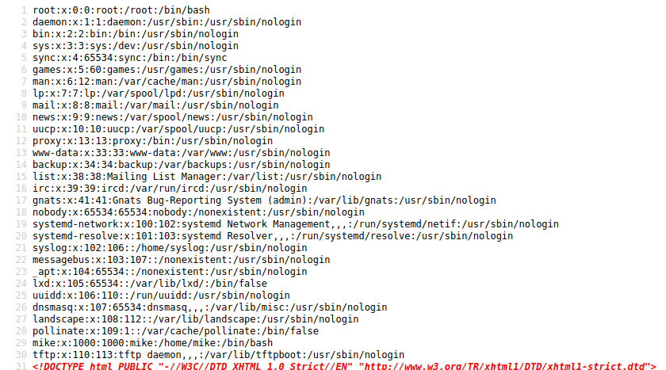
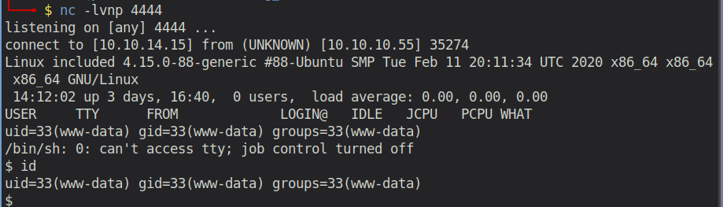

# Starting Point - Included

## Enumeration

```
rustscan 10.10.10.55 -- -sC -sV -o port_scan

PORT   STATE SERVICE REASON  VERSION
80/tcp open  http    syn-ack Apache httpd 2.4.29 ((Ubuntu))
| http-methods: 
|_  Supported Methods: GET HEAD POST OPTIONS
|_http-server-header: Apache/2.4.29 (Ubuntu)
| http-title: Site doesn't have a title (text/html; charset=UTF-8).
|_Requested resource was http://10.10.10.55/?file=index.php
```
So apparently only a single port is open. It's exposing an Apache webserver. Let's take a look at it.

### Examining Port 80 - Apache Server


Looking at the URL and having the name of the challenge in mind (`Included`), an experienced web penetration tester might directly think of Local File Inclusion (LFI). 

And indeed! Changing the URL to 
```
http://10.10.10.55/?file=../../../../../../../../etc/passwd
```
reveals the `/etc/passwd` file of the server.



Now we check if we can also access `/proc/self/environ`. This file hosts the initial environment of the Apache process. Thus, the environmental variable User-Agent is likely to appear there. If we can access it, then we can easily create a reverse shell by injecting php code as e.g. the User-Agent in our request to the server (=Proc Environ Injection). Unfortunately, we cannot access it.

Another possibility would be to access `/var/log/apache2/access.log` after we sent a request to the website with PHP code as file parameter. The PHP code would then be executed, when loading the log file (=Log Poisoning). However, that's also not possible. Therefore, we need another technique.

A blog article with details about the various techniques can be found [here](https://outpost24.com/blog/from-local-file-inclusion-to-remote-code-execution-part-1).

I was pretty much stuck at this point. So I went through all the enumeration steps again. Thereby, I noticed, that `rustscan` does not support UDP port scanning at the time I'm writing this (https://github.com/RustScan/RustScan/issues/22).

Therefore, I ran the nmap scan again, but this time with a UDP scan:

```
sudo nmap -sU 10.10.10.55

PORT   STATE         SERVICE
69/udp open|filtered tftp
```

That's perfect for our LFI! We can now upload files to `/var/lib/tftpboot` (which is the default location), due to the misconfigured TFTP service (--create, -c
Allow new files to be created. By default, tftpd will only allow upload of files that already exist. Files are created with default permissions allowing anyone to read or write them, unless the --permissive or --umask options are specified.)

So now we can upload a php file that contains code for a reverse shell to our machine. Afterwards, we will execute the file by loading it with our LFI vulnerability.

For the PHP Shell, we use the Shell from Pentestmonkey (which is pretty much the standard when it comes to PHP reverse shells). We upload it with

```
tftp 10.10.10.15

put shell.php
```

Now start the listener `nc -lvpn 4444` and include the file by accessing following page: 

```
http://10.10.10.55/?file=../../../../../var/lib/tftpboot/shell.php
```



## Exploitation

After several hours of research, I again had to take a look at the writeup, as I could not find any vulnerability on the system. And indeed! There is no vulnerability. The writeup simply says "The password Sheffield19 found in the previous can be used to switch to mike"... Like seriously, come on... Again one of those "we found the password in any of the previous machines for a completely unrelated user. It's obvious that you should use this password here as well". **FACEPALM** But w/e....

Now that we are user `mike`, we can look for a way to escalate our privileges. But first let's retrieve the user flag: `a56ef91d70cfbf2cdb8f454c006935a1`

Running the command `id`, we see that mike is in the group `lxc`. Following [this article](https://book.hacktricks.xyz/linux-unix/privilege-escalation/interesting-groups-linux-pe/lxd-privilege-escalation), on how to obtain root privileges by abusing the `security.privileged=true` feature of lxc, we get root accces.

## Post-Exploitation
In the root directory there are two files:
  - root.txt: `c693d9c7499d9f572ee375d4c14c7bcf`
  - login.sql: `Daniel:>SNDv*2wzLWf` (credentials for another machine)