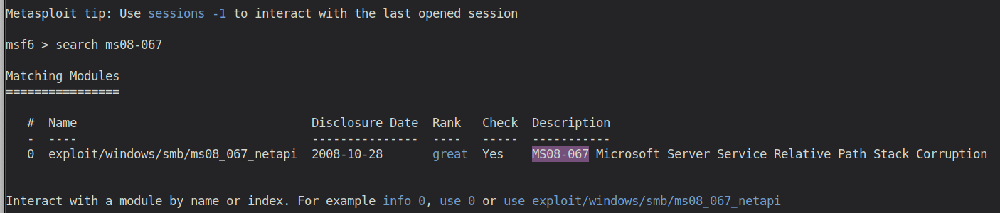
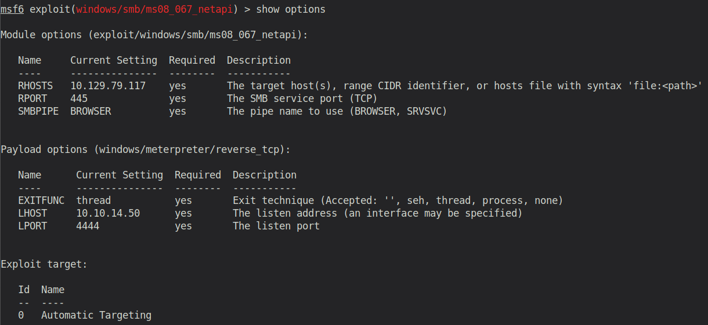
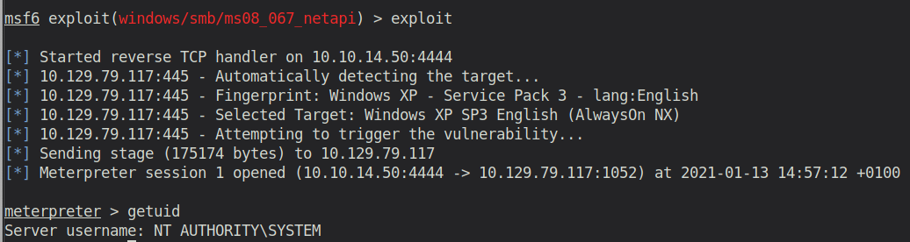

# Legacy (Windows)

## Enumeration

```
rustscan 10.129.79.117 -- -sC -sV -o port_scan

PORT     STATE  SERVICE       VERSION
139/tcp  open   netbios-ssn   Microsoft Windows netbios-ssn
445/tcp  open   microsoft-ds  Windows XP microsoft-ds
3389/tcp closed ms-wbt-server
Service Info: OSs: Windows, Windows XP; CPE: cpe:/o:microsoft:windows, cpe:/o:microsoft:windows_xp

Host script results:
|_clock-skew: mean: 5d00h57m39s, deviation: 1h24m50s, median: 4d23h57m39s
|_nbstat: NetBIOS name: nil, NetBIOS user: <unknown>, NetBIOS MAC: 00:50:56:b9:41:6a (VMware)
| smb-os-discovery: 
|   OS: Windows XP (Windows 2000 LAN Manager)
|   OS CPE: cpe:/o:microsoft:windows_xp::-
|   Computer name: legacy
|   NetBIOS computer name: LEGACY\x00
|   Workgroup: HTB\x00
|_  System time: 2021-01-18T17:21:39+02:00
| smb-security-mode: 
|   account_used: <blank>
|   authentication_level: user
|   challenge_response: supported
|_  message_signing: disabled (dangerous, but default)
|_smb2-time: Protocol negotiation failed (SMB2)

Service detection performed. Please report any incorrect results at https://nmap.org/submit/ .
```

Both SMB ports, 139 & 445, are open. So this is again a machine with an SMB challenge/vulnerability. 

By running the default nmap scripts (-sC), we can already see that it's a machine with a rather old OS (Windows XP with Windows 2000 LAN Manager). This might be the reason why this machine is called `Legacy`. Let's further investigate that.

## Exploitation

Googling for "`windows xp windows 2000 manager vulnerability`", we literally get hundreds of results all pointing towards `MS08-067 - Critical: Vulnerability in Server Service Could Allow Remote Code Execution`. 

Using searchsploit, we also get a list of already existing exploits for this vulnerability. 

Therefore, I decided to use metasploit, to make things easier (this time at least).



Metasploit already offers us a module for this vulnerability. Let's use it!

Settings should be defined as follows (insert your IP into LHOST):



After exeucting the exploit, we receive a meterpreter shell:



Now what's left is to obtain the user and root flag.
There are several way how to do that. I decided to go for the simply `shell` spawn and search for them manually.

## Post Exploitation

User Flag:
```
C:\Documents and Settings\john\Desktop>type user.txt
type user.txt
e69af0e4f443de7e36876fda4ec7644f
```

Root Flag:
```
C:\Documents and Settings\Administrator\Desktop>type root.txt
type root.txt
993442d258b0e0ec917cae9e695d5713
```